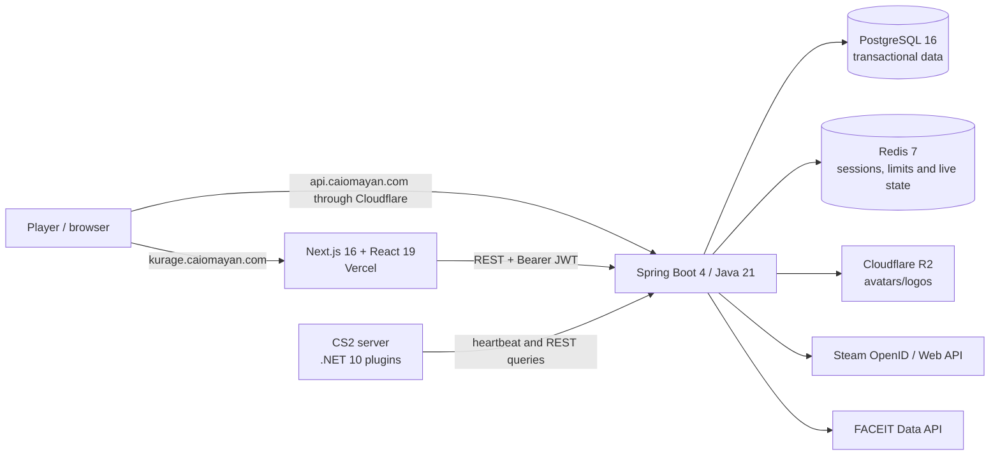

# Kurage

[Versão em português](./README.md)

> Competitive identity, team operations, and instrumented Counter-Strike 2
> servers in one platform.

Kurage is a proprietary SaaS product in development for competitive CS2 players
and teams. Its chosen product loop is straightforward: sign in with Steam,
organize a team, start an on-demand private session, record the match, and turn
the result into a public, auditable competitive passport.

## Project status

**Closed technical-alpha candidate — not ready for public or paid production.**
As of 29 August 2026, automated gates pass and the security baseline is hardened.
Before real users are invited, external infrastructure must be configured, a
restore drill performed, legal drafts completed/reviewed, and visual plus real
Retake smoke tests completed. Match/ELO, DM, dynamic 5v5, and billing remain
outside this release.

| Capability | Verified status |
|---|---|
| Steam OpenID, short-lived JWT and rotating refresh | Implemented with one-time state, replay protection, and atomic Redis rotation |
| Profile, settings and FACEIT link | Implemented |
| Player and team rankings | Read/UI implemented; no match result updates the ELO |
| Teams, invitations, links and roles | API implemented; web experience incomplete |
| Virtual inventory and loadout | Persistence/UI implemented; plugin does not apply skins in CS2 |
| Server browser and heartbeat | Working with hashed per-server credentials; no dynamic provisioning or tenancy |
| Notifications | PostgreSQL content plus per-recipient delivery; complete frontend experience missing |
| Maré membership | Single plan, entitlements, and coral identity implemented; no checkout or webhook |
| Production, observability and disaster recovery | Metrics and runbook implemented; external alerts and first restore drill pending |

See the evidence-based [current-state audit](./docs/en/08_current_state_audit.md),
the [product and go-to-market plan](./docs/en/09_product_market.md), and the
[Maré plan contract](./docs/en/12_mare_membership.md).

## Current architecture



The backend is a **modular monolith**, not a microservices system. That is the
right architecture for the current stage. The target design keeps one API
deployment, keeps notifications in PostgreSQL, uses an outbox for events, and
defines identity, teams, competitive, control-plane, billing and entitlement
modules. Servers will initially be provisioned through DatHost's API and billing
will use Mercado Pago in BRL.

## Technology

- Frontend: Next.js 16, React 19, TypeScript, Tailwind CSS 4, TanStack Query.
- Backend: Java 21, Spring Boot 4.1, Spring Security, JPA, Flyway, Maven.
- Data: PostgreSQL and Redis; Cloudflare R2 for media.
- Game: C#/.NET 10 plugins using CounterStrikeSharp.
- Local infrastructure: Docker Compose; Caddy is configured as reverse proxy and trust boundary.
- Alpha infrastructure: frontend on Vercel and backend on OCI Ampere A1 through Terraform and GitHub Actions.

## Repository layout

```text
kurage/
├── backend/          API, migrations, and local infrastructure
├── frontend/         Next.js web application
├── server/plugins/   CounterStrikeSharp integrations
├── docs/pt/          Portuguese documentation
├── docs/en/          English documentation
├── infra/            OCI Terraform, bootstrap, and portable releases
└── assets/           design material pending rights review
```

## Local development

Requirements: Java 21, Maven 3.9+, Node.js 24+, npm 11+, and Docker Compose.
Building the plugins also requires the .NET 10 SDK and a compatible
CounterStrikeSharp host.

1. Infrastructure and backend (PowerShell):

   ```powershell
   Set-Location backend
   Copy-Item .env.example .env
   # Fill STEAM_API_KEY and FACEIT_API_KEY and generate a unique JWT_SECRET.
   docker compose -f compose.yaml --env-file .env up -d
   mvn spring-boot:run
   ```

2. Frontend, in another terminal:

   ```powershell
   Set-Location frontend
   Copy-Item .env.local.example .env.local
   npm ci
   npm run dev
   ```

3. Open `http://localhost:3000`. Never reuse example credentials outside local
   development.

## Verified quality baseline

- Backend: 172 unit tests and 23 real integrations validated together against
  PostgreSQL 16, authenticated Redis 7, Testcontainers, and Flyway V1–V10.
- Java packaging: completed and produced a JAR.
- Development and production Compose files: syntactically valid.
- C# plugins: `Kurage.Core` and `Kurage.RetakeWeapons` compiled in Release with
  .NET 10, with no warnings or errors.
- Frontend: zero lint issues, 29 passing tests, and a successful production build.
- Local visual browser test: unavailable due to a trusted browser-runtime setup
  failure; it was not replaced with an unauthorized automation path.

The current tests do not yet cover external providers, a dedicated CS2 server,
billing, or the commercial end-to-end flow. See the
[testing strategy](./docs/en/11_integration_testing.md).

## Product and roadmap

The first users are captains and players from amateur and semi-professional teams,
aged 18 or over, in Brazil and then Latin America. The north-star metric is
**weekly active teams completing at least one instrumented match**.

1. **P0 — trust:** finish per-server credentials, secure uploads, account status,
   LGPD controls, backups, and an audit trail.
2. **MVP — competitive loop:** team web UX, idempotent matches, auditable ELO,
   trustworthy telemetry and on-demand private servers.
3. **Revenue:** Mercado Pago, idempotent webhooks, entitlements and prepaid server
   hour credits with protected margin.
4. **Scale:** observability, fraud controls, seasons, tournaments and regions.

## Intellectual property and publication

The canonical repository must remain **private**. The public portfolio artifact
will be a sanitized case study containing architecture, outcomes, original
screenshots and engineering decisions; recruiters may receive time-limited access
to the private repository. This protects chain-of-title and software-registration
evidence.

The core is governed by the [Kurage proprietary license](./LICENSE). Only
`server/plugins` is [MIT-licensed](./server/plugins/LICENSE), as required by the
official CounterStrikeSharp exception. Also read the
[third-party notices](./THIRD_PARTY_NOTICES.md), [security policy](./SECURITY.md),
and [contribution policy](./CONTRIBUTING.md).

Counter-Strike, CS2, Steam, Valve, and FACEIT belong to their respective owners.
Kurage is independent and is not affiliated with or endorsed by them.

## Documentation

- [English index](./docs/en/00_index.md)
- [Índice em português](./docs/pt/00_index.md)
- [Full audit EN](./docs/en/08_current_state_audit.md)
- [Auditoria completa PT](./docs/pt/08_auditoria_estado_atual.md)
- [Product and market EN](./docs/en/09_product_market.md)
- [Produto e mercado PT](./docs/pt/09_produto_mercado.md)
- [PostgreSQL notifications EN](./docs/en/10_postgres_notifications.md)
- [Integration testing EN](./docs/en/11_integration_testing.md)
- [OCI/Vercel deployment EN](./docs/en/17_oci_vercel_alpha_deployment.md)
