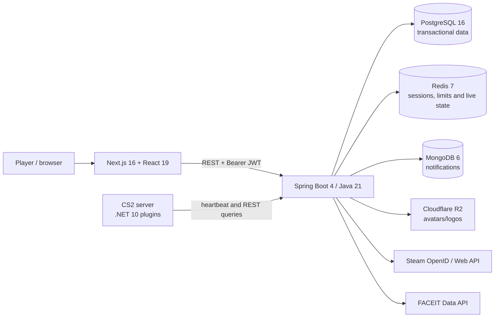

# Kurage

[Versão em português](./README.md)

> Competitive identity, team operations, and instrumented Counter-Strike 2
> servers in one platform.

Kurage is a proprietary SaaS product in development for competitive CS2 players
and teams. Its chosen product loop is straightforward: sign in with Steam,
organize a team, start an on-demand private session, record the match, and turn
the result into a public, auditable competitive passport.

## Project status

**Technical alpha — not ready for production or billing.** As of 20 August 2026,
the code builds and the Java test suite passes, but match/ELO processing,
recurring billing, real server provisioning, in-game loadout application, and P0
security controls are still missing. Domains previously described as production
were not publicly operational during the audit.

| Capability | Verified status |
|---|---|
| Steam OpenID, short-lived JWT and rotating refresh | Implemented; anti-replay/state protection missing |
| Profile, settings and FACEIT link | Implemented |
| Player and team rankings | Read/UI implemented; no match result updates the ELO |
| Teams, invitations, links and roles | API implemented; web experience incomplete |
| Virtual inventory and loadout | Persistence/UI implemented; plugin does not apply skins in CS2 |
| Server browser and heartbeat | Working prototype; no provisioning, tenancy or per-server credential |
| Notifications | MongoDB API; complete frontend experience missing |
| FREE/PLUS/PRO/MAX subscriptions | UI model and flags only; no checkout, webhook or commercial entitlement |
| Production, observability and disaster recovery | Not implemented |

See the evidence-based [current-state audit](./docs/en/08_current_state_audit.md)
and the single [product and go-to-market plan](./docs/en/09_product_market.md).

## Current architecture



The backend is a **modular monolith**, not a microservices system. That is the
right architecture for the current stage. The target design keeps one API
deployment, moves notifications to PostgreSQL, uses an outbox for events, and
defines identity, teams, competitive, control-plane, billing and entitlement
modules. Servers will initially be provisioned through DatHost's API and billing
will use Mercado Pago in BRL.

## Technology

- Frontend: Next.js 16, React 19, TypeScript, Tailwind CSS 4, TanStack Query.
- Backend: Java 21, Spring Boot 4.1, Spring Security, JPA, Flyway, Maven.
- Data: PostgreSQL, Redis and currently MongoDB; Cloudflare R2 for media.
- Game: C#/.NET 10 plugins using CounterStrikeSharp.
- Local infrastructure: Docker Compose; Caddy is planned as reverse proxy.

## Repository layout

```text
kurage/
├── backend/          API, migrations, and local infrastructure
├── frontend/         Next.js web application
├── server/plugins/   CounterStrikeSharp integrations
├── docs/pt/          Portuguese documentation
├── docs/en/          English documentation
└── assets/           design material pending rights review
```

## Local development

Requirements: Java 21, Maven 3.9+, Node.js 24+, npm 11+, and Docker Compose.
Building the plugins also requires the .NET 10 SDK and a compatible
CounterStrikeSharp host.

1. Infrastructure and backend (PowerShell):

   ```powershell
   Set-Location backend
   Copy-Item .env.example .env
   # Fill STEAM_API_KEY and FACEIT_API_KEY and generate a unique JWT_SECRET.
   docker compose -f compose.yaml --env-file .env up -d
   mvn spring-boot:run
   ```

2. Frontend, in another terminal:

   ```powershell
   Set-Location frontend
   Copy-Item .env.local.example .env.local
   npm ci
   npm run dev
   ```

3. Open `http://localhost:3000`. Never reuse example credentials outside local
   development.

## Verified quality baseline

- Backend: **137 tests across 22 suites; zero failures, errors or skips**.
- Java packaging: completed and produced a JAR.
- Development and production Compose files: syntactically valid.
- C# plugins: static review complete; build unavailable because no .NET SDK is
  installed in the audit environment.
- Frontend: see the audit validation section for the latest exact result.
- Local visual browser test: unavailable due to a trusted browser-runtime setup
  failure; it was not replaced with an unauthorized automation path.

The current tests do not cover real PostgreSQL/Redis/Mongo integration, external
providers, a dedicated CS2 server, billing, or the commercial end-to-end flow.

## Product and roadmap

The first users are captains and players from amateur and semi-professional teams,
aged 18 or over, in Brazil and then Latin America. The north-star metric is
**weekly active teams completing at least one instrumented match**.

1. **P0 — trust:** fail-closed secrets, private databases, Steam state/nonce,
   secure uploads, LGPD, CI, backups and truthful documentation.
2. **MVP — competitive loop:** team web UX, idempotent matches, auditable ELO,
   trustworthy telemetry and on-demand private servers.
3. **Revenue:** Mercado Pago, idempotent webhooks, entitlements and prepaid server
   hour credits with protected margin.
4. **Scale:** observability, fraud controls, seasons, tournaments and regions.

## Intellectual property and publication

The canonical repository must remain **private**. The public portfolio artifact
will be a sanitized case study containing architecture, outcomes, original
screenshots and engineering decisions; recruiters may receive time-limited access
to the private repository. This protects chain-of-title and software-registration
evidence.

The core is governed by the [Kurage proprietary license](./LICENSE). Only
`server/plugins` is [MIT-licensed](./server/plugins/LICENSE), as required by the
official CounterStrikeSharp exception. Also read the
[third-party notices](./THIRD_PARTY_NOTICES.md), [security policy](./SECURITY.md),
and [contribution policy](./CONTRIBUTING.md).

Counter-Strike, CS2, Steam, Valve, and FACEIT belong to their respective owners.
Kurage is independent and is not affiliated with or endorsed by them.

## Documentation

- [English index](./docs/en/00_index.md)
- [Índice em português](./docs/pt/00_index.md)
- [Full audit EN](./docs/en/08_current_state_audit.md)
- [Auditoria completa PT](./docs/pt/08_auditoria_estado_atual.md)
- [Product and market EN](./docs/en/09_product_market.md)
- [Produto e mercado PT](./docs/pt/09_produto_mercado.md)

