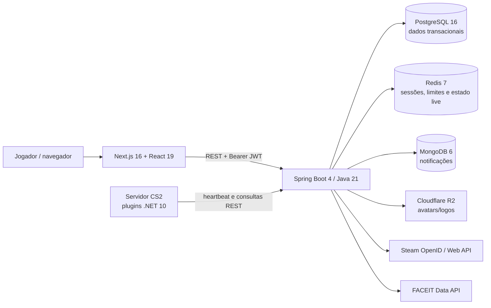

# Kurage

[English version](./README.en.md)

> Identidade competitiva, operação de times e servidores instrumentados de
> Counter-Strike 2 em uma única plataforma.

Kurage é um produto SaaS proprietário em desenvolvimento para jogadores e times
competitivos de CS2. O fluxo de produto escolhido é simples: entrar com Steam,
organizar o time, iniciar uma sessão privada sob demanda, registrar a partida e
transformar o resultado em um passaporte competitivo público e auditável.

## Estado do projeto

**Alfa técnica — não pronto para produção ou cobrança.** Em 20 de agosto de 2026,
o código compila e a suíte Java passa, mas ainda faltam o motor de partidas/ELO,
cobrança recorrente, provisionamento real de servidores, aplicação de loadout no
jogo e os controles de segurança P0. Os domínios antes documentados como produção
não estavam publicamente operacionais durante a auditoria.

| Capacidade | Estado verificável |
|---|---|
| Steam OpenID, JWT curto e refresh rotativo | Implementado; falta proteção anti-replay/state |
| Perfil, configurações e vínculo FACEIT | Implementado |
| Rankings de jogadores e times | Consulta/UI implementadas; ELO não recebe resultados de partidas |
| Times, convites, links e papéis | API implementada; experiência web incompleta |
| Inventário virtual e loadout | Persistência/UI implementadas; plugin não aplica skins no CS2 |
| Browser e heartbeat de servidor | Protótipo funcional; sem provisionamento, tenancy ou credencial individual |
| Notificações | API em MongoDB; sem experiência completa no frontend |
| Assinaturas FREE/PLUS/PRO/MAX | Modelo visual e flags; sem checkout, webhook ou entitlement comercial |
| Produção, observabilidade e disaster recovery | Não implementados |

A revisão completa, incluindo evidências por arquivo, riscos e priorização, está em
[Auditoria do estado atual](./docs/pt/08_auditoria_estado_atual.md). A proposta
comercial única está em [Produto, mercado e execução](./docs/pt/09_produto_mercado.md).

## Arquitetura atual



O backend é um **monólito modular**, não um conjunto de microserviços. Essa é a
arquitetura correta para o estágio atual. A evolução definida mantém um único
deploy da API, consolida notificações no PostgreSQL, usa outbox para eventos e
separa módulos de identidade, times, competitivo, control plane, billing e
entitlements. Servidores serão provisionados primeiro por API da DatHost; cobrança
será feita com Mercado Pago em BRL.

## Tecnologias

- Frontend: Next.js 16, React 19, TypeScript, Tailwind CSS 4 e TanStack Query.
- Backend: Java 21, Spring Boot 4.1, Spring Security, JPA, Flyway e Maven.
- Dados: PostgreSQL, Redis e MongoDB no estado atual; Cloudflare R2 para mídia.
- Jogo: plugins C#/.NET 10 com CounterStrikeSharp.
- Infra local: Docker Compose; Caddy previsto como reverse proxy.

## Estrutura

```text
kurage/
├── backend/          API, migrations e infraestrutura local
├── frontend/         aplicação web Next.js
├── server/plugins/   integrações CounterStrikeSharp
├── docs/pt/          documentação em português
├── docs/en/          documentação em inglês
└── assets/           material de design sujeito a auditoria de direitos
```

## Execução local

Pré-requisitos: Java 21, Maven 3.9+, Node.js 24+, npm 11+ e Docker com Compose.
Para compilar os plugins, instale também o SDK .NET 10 e um host compatível do
CounterStrikeSharp.

1. Infra e backend (PowerShell):

   ```powershell
   Set-Location backend
   Copy-Item .env.example .env
   # Preencha STEAM_API_KEY, FACEIT_API_KEY e gere um JWT_SECRET exclusivo.
   docker compose -f compose.yaml --env-file .env up -d
   mvn spring-boot:run
   ```

2. Frontend, em outro terminal:

   ```powershell
   Set-Location frontend
   Copy-Item .env.local.example .env.local
   npm ci
   npm run dev
   ```

3. Acesse `http://localhost:3000`. Nunca reutilize as credenciais de exemplo fora
   do ambiente local.

## Qualidade validada

- Backend: **137 testes em 22 suítes, sem falhas, erros ou testes ignorados**.
- Empacotamento Java: concluído; JAR gerado.
- Docker Compose de desenvolvimento e produção: configuração sintaticamente válida.
- Plugins C#: revisão estática concluída; build não executado porque o ambiente não
  possui SDK .NET.
- Frontend: consulte a seção de validação da auditoria para o resultado mais atual.
- Teste visual no navegador local: indisponível nesta auditoria por falha do runtime
  confiável do navegador; não substituído por uma automação não autorizada.

Os testes existentes não cobrem ainda PostgreSQL/Redis/Mongo reais, integrações
externas, servidor dedicado CS2, cobrança ou o fluxo E2E comercial.

## Produto e roadmap

O primeiro público é composto por capitães e jogadores de times amadores e
semiprofissionais, com 18 anos ou mais, no Brasil e depois na América Latina. A
métrica norte é **times ativos por semana com ao menos uma partida instrumentada
concluída**.

1. **P0 — confiança:** segredos fail-closed, bancos privados, Steam state/nonce,
   uploads seguros, LGPD, CI, backups e documentação fiel.
2. **MVP — loop competitivo:** time web, partida idempotente, ELO auditável,
   telemetria confiável e servidor privado sob demanda.
3. **Receita:** Mercado Pago, webhooks idempotentes, entitlements e créditos de
   horas de servidor com margem protegida.
4. **Escala:** observabilidade, fraude, temporadas, torneios e expansão regional.

## Propriedade intelectual e publicação

O repositório canônico deve permanecer **privado**. O portfólio público será um
case sanitizado com arquitetura, resultados, screenshots próprios e decisões de
engenharia; recrutadores podem receber acesso temporário ao repositório privado.
Essa política protege a cadeia de titularidade e os artefatos usados no registro
do software.

O núcleo está sob a [licença proprietária Kurage](./LICENSE). Apenas
`server/plugins` está sob [MIT](./server/plugins/LICENSE), exigência compatível com
a exceção oficial do CounterStrikeSharp. Consulte também
[avisos de terceiros](./THIRD_PARTY_NOTICES.md), [segurança](./SECURITY.md) e
[contribuição](./CONTRIBUTING.md).

Counter-Strike, CS2, Steam, Valve e FACEIT pertencem aos seus respectivos titulares.
Kurage é independente e não possui afiliação ou endosso dessas empresas.

## Documentação

- [Índice em português](./docs/pt/00_index.md)
- [English documentation](./docs/en/00_index.md)
- [Auditoria completa PT](./docs/pt/08_auditoria_estado_atual.md)
- [Full audit EN](./docs/en/08_current_state_audit.md)
- [Produto e mercado PT](./docs/pt/09_produto_mercado.md)
- [Product and market EN](./docs/en/09_product_market.md)

