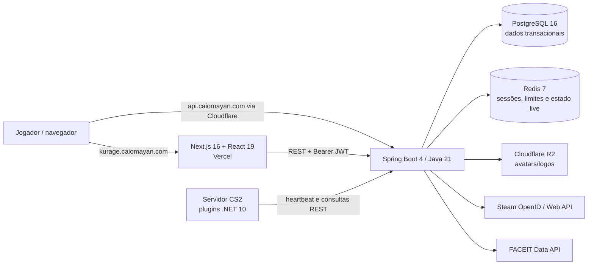

# Kurage

[English version](./README.en.md)

> Identidade competitiva, operação de times e servidores instrumentados de
> Counter-Strike 2 em uma única plataforma.

Kurage é um produto SaaS proprietário em desenvolvimento para jogadores e times
competitivos de CS2. O fluxo de produto escolhido é simples: entrar com Steam,
organizar o time, iniciar uma sessão privada sob demanda, registrar a partida e
transformar o resultado em um passaporte competitivo público e auditável.

## Estado do projeto

**Alfa web privada operacional — não pronta para produção pública ou cobrança.**
Em 31 de agosto de 2026, Vercel/OCI/Cloudflare estavam publicados, frontend e
health da API responderam HTTP 200 e o operador confirmou sessão, inventário e
avatar. Antes de convidar público ainda é obrigatório executar restore, concluir
monitoramento e revisão jurídica, além do smoke com Retake público real. Motor de
partidas/ELO, DM, 5v5 dinâmico e pagamento permanecem fora deste release.

| Capacidade | Estado verificável |
|---|---|
| Steam OpenID, JWT curto e refresh rotativo | Implementado com state one-time, anti-replay e rotação Redis atômica |
| Perfil, configurações e vínculo FACEIT | Implementado |
| Rankings de jogadores e times | Consulta/UI implementadas; ELO não recebe resultados de partidas |
| Times, convites, links e papéis | API implementada; experiência web incompleta |
| Inventário virtual e loadout | Persistência/UI implementadas; plugin não aplica skins no CS2 |
| Browser e heartbeat de servidor | Funcional com credencial hash individual; sem provisionamento dinâmico ou tenancy |
| Notificações | PostgreSQL com conteúdo e entrega por destinatário; sem experiência completa no frontend |
| Assinatura Maré | Plano único, entitlements e identidade coral implementados; sem checkout ou webhook |
| Deploy web, observabilidade e disaster recovery | Web alfa operacional; métricas/runbook implementados; alertas externos e primeiro ensaio de restore pendentes |

A revisão completa, incluindo evidências por arquivo, riscos e priorização, está em
[Auditoria do estado atual](./docs/pt/08_auditoria_estado_atual.md). A proposta
comercial está em [Produto, mercado e execução](./docs/pt/09_produto_mercado.md)
e o contrato do plano em [Plano Maré](./docs/pt/12_plano_mare.md).

## Arquitetura atual



O backend é um **monólito modular**, não um conjunto de microserviços. Essa é a
arquitetura correta para o estágio atual. A evolução definida mantém um único
deploy da API, mantém notificações no PostgreSQL, usa outbox para eventos e
separa módulos de identidade, times, competitivo, control plane, billing e
entitlements. Servidores serão provisionados primeiro por API da DatHost; cobrança
será feita com Mercado Pago em BRL.

## Tecnologias

- Frontend: Next.js 16, React 19, TypeScript, Tailwind CSS 4 e TanStack Query.
- Backend: Java 21, Spring Boot 4.1, Spring Security, JPA, Flyway e Maven.
- Dados: PostgreSQL e Redis; Cloudflare R2 para mídia.
- Jogo: plugins C#/.NET 10 com CounterStrikeSharp.
- Infra local: Docker Compose; Caddy configurado como reverse proxy e fronteira de confiança.
- Infra da alfa: frontend na Vercel e backend em OCI Ampere A1 via Terraform e GitHub Actions.

## Estrutura

```text
kurage/
├── backend/          API, migrations e infraestrutura local
├── frontend/         aplicação web Next.js
├── server/plugins/   integrações CounterStrikeSharp
├── docs/pt/          documentação em português
├── docs/en/          documentação em inglês
├── infra/            Terraform OCI, bootstrap e release portável
└── assets/           material de design sujeito a auditoria de direitos
```

## Execução local

Pré-requisitos: Java 21, Maven 3.9+, Node.js 24+, npm 11+ e Docker com Compose.
Para compilar os plugins, instale também o SDK .NET 10 e um host compatível do
CounterStrikeSharp.

1. Infra e backend (PowerShell):

   ```powershell
   Set-Location backend
   Copy-Item .env.example .env
   # Preencha STEAM_API_KEY, FACEIT_API_KEY e gere um JWT_SECRET exclusivo.
   docker compose -f compose.yaml --env-file .env up -d
   mvn spring-boot:run
   ```

2. Frontend, em outro terminal:

   ```powershell
   Set-Location frontend
   Copy-Item .env.local.example .env.local
   npm ci
   npm run dev
   ```

3. Acesse `http://localhost:3000`. Nunca reutilize as credenciais de exemplo fora
   do ambiente local.

## Qualidade validada

- Backend: 172 testes unitários e 23 integrações reais validados em conjunto com
  PostgreSQL 16, Redis 7 autenticado, Testcontainers e Flyway V1–V10.
- Empacotamento Java: concluído; JAR gerado.
- Docker Compose de desenvolvimento e produção: configuração sintaticamente válida.
- Plugins C#: `Kurage.Core` e `Kurage.RetakeWeapons` compilados em Release com
  .NET 10, sem avisos ou erros.
- Frontend: lint sem erros, 29 testes aprovados e build Next.js de produção concluído.
- Teste visual no navegador local: indisponível nesta auditoria por falha do runtime
  confiável do navegador; não substituído por uma automação não autorizada.
- Smoke manual do ambiente web publicado: frontend/health, sessão, inventário e
  avatar confirmados pelo operador em 31/08/2026; não inclui Retake público.

Os testes ainda não cobrem integrações externas, servidor dedicado CS2, cobrança
ou o fluxo E2E comercial. Consulte a [estratégia de testes](./docs/pt/11_testes_integracao.md).

## Produto e roadmap

O primeiro público é composto por capitães e jogadores de times amadores e
semiprofissionais, com 18 anos ou mais, no Brasil e depois na América Latina. A
métrica norte é **times ativos por semana com ao menos uma partida instrumentada
concluída**.

1. **P0 — confiança:** concluir credenciais individuais de servidor, uploads
   seguros, account status, LGPD, backups e trilha de auditoria.
2. **MVP — loop competitivo:** time web, partida idempotente, ELO auditável,
   telemetria confiável e servidor privado sob demanda.
3. **Receita:** Mercado Pago, webhooks idempotentes, entitlements e créditos de
   horas de servidor com margem protegida.
4. **Escala:** observabilidade, fraude, temporadas, torneios e expansão regional.

## Propriedade intelectual e publicação

O repositório canônico está **público** no GitHub e funciona como artefato de
portfólio do produto. A visibilidade pública não transforma o núcleo em software
livre nem concede direitos além dos descritos na licença: dados reais, segredos,
dumps, credenciais, ativos sem cadeia de direitos e detalhes operacionais
sensíveis não devem entrar no histórico. Commits atribuíveis, tags e releases
imutáveis preservam evidências úteis de autoria e evolução do software.

O núcleo está sob a [licença proprietária Kurage](./LICENSE). Apenas
`server/plugins` está sob [MIT](./server/plugins/LICENSE), exigência compatível com
a exceção oficial do CounterStrikeSharp. Consulte também
[avisos de terceiros](./THIRD_PARTY_NOTICES.md), [segurança](./SECURITY.md) e
[contribuição](./CONTRIBUTING.md).

Counter-Strike, CS2, Steam, Valve e FACEIT pertencem aos seus respectivos titulares.
Kurage é independente e não possui afiliação ou endosso dessas empresas.

## Documentação

- [Índice em português](./docs/pt/00_index.md)
- [English documentation](./docs/en/00_index.md)
- [Auditoria completa PT](./docs/pt/08_auditoria_estado_atual.md)
- [Full audit EN](./docs/en/08_current_state_audit.md)
- [Produto e mercado PT](./docs/pt/09_produto_mercado.md)
- [Notificações no PostgreSQL PT](./docs/pt/10_notificacoes_postgres.md)
- [Testes de integração PT](./docs/pt/11_testes_integracao.md)
- [Operação e gate de release PT](./docs/pt/15_operacao_e_release.md)
- [Prontidão jurídica PT](./docs/pt/16_prontidao_juridica.md)
- [Deploy OCI/Vercel PT](./docs/pt/17_deploy_alpha_oci_vercel.md)
- [Plano de evolução de identidade, perfil e ranking PT](./docs/pt/19_plano_evolucao_identidade_rating_perfil.md)
- [Product and market EN](./docs/en/09_product_market.md)
