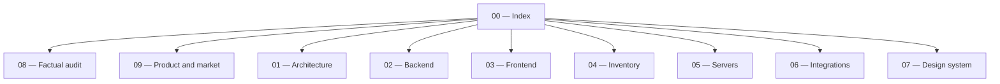

# Kurage ecosystem — documentation index

[Índice em português](../pt/00_index.md)

## Status and maintenance rule

Kurage is a **technical alpha**. No public production or validated billing existed
on the 20 August 2026 baseline. The
[current-state audit](./08_current_state_audit.md) is the factual reference for
implemented, incomplete, and planned behavior. Documents 01–07 describe components
and intent; discrepancies must be corrected in the same pull request as code.

Every new document must explicitly identify:

- **implemented:** exists in code and was validated;
- **prototype:** partially exists but cannot support a commercial promise;
- **planned:** does not exist yet;
- date/commit of the last validation.

## System overview

Kurage is a proprietary SaaS in development for competitive identity, team
operations, on-demand private servers, and verifiable Counter-Strike 2 results.
The current backend is a Spring Boot modular monolith used by a Next.js frontend
and CounterStrikeSharp plugins.

## Documents

1. [Architecture and infrastructure](./01_architecture_infrastructure.md)
2. [Backend core](./02_backend_core.md)
3. [Frontend core](./03_frontend_core.md)
4. [CS2 inventory subsystem](./04_cs2_inventory_subsystem.md)
5. [CS2 game-server subsystem](./05_game_servers_subsystem.md)
6. [External integrations](./06_external_integrations.md)
7. [Design system](./07_frontend_design_system.md)
8. [Complete current-state audit](./08_current_state_audit.md)
9. [Product, market, monetization, and portfolio](./09_product_market.md)

## Repository policies

- [Main README](../../README.en.md)
- [Proprietary license](../../LICENSE)
- [Plugin MIT license](../../server/plugins/LICENSE)
- [Third-party notices](../../THIRD_PARTY_NOTICES.md)
- [Security policy](../../SECURITY.md)
- [Contribution policy](../../CONTRIBUTING.md)

The former `kurage.caiomayan.com` and `apikurage.caiomayan.com` domains are
configuration references, not evidence of an operational production environment.

