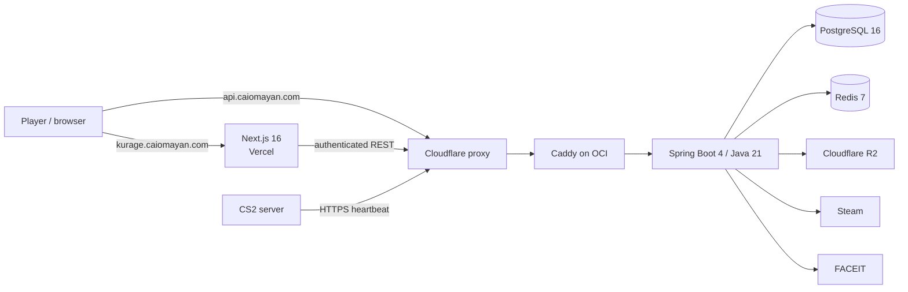

# Architecture and infrastructure

> **Status on 29 August 2026:** the alpha topology is implemented in the
> repository but has not been applied to external accounts. The
> [factual audit](./08_current_state_audit.md) remains the source of functional
> readiness claims.

[← Return to the index](./00_index.md)

## Adopted topology

Kurage is a modular monolith, not a microservices system. The browser loads
Next.js from Vercel and consumes the public API through Cloudflare. The API and
both data stores share one OCI VM during alpha.

## Components

### Frontend

- Vercel is linked to the GitHub repository with `frontend` as root directory.
- Alpha domain: `kurage.caiomayan.com`.
- Public variables target `https://api.caiomayan.com`.
- Preview origins never receive credentialed wildcard CORS. An authenticated
  preview needs one stable, explicitly authorized hostname.

### Backend and data

- OCI `VM.Standard.A1.Flex`, ARM64, 2 OCPUs, 6 GB, Ubuntu 24.04.
- Caddy exposes only 80/443; Spring, PostgreSQL, and Redis remain on the Compose
  network.
- PostgreSQL is the transactional store, including inventory, teams,
  invitations, and notifications.
- Redis stores ephemeral sessions, revocation, rate limits, and caches.
- Production PostgreSQL pool: maximum 10, minimum idle 2.
- Prepared limits: API 1.6 GB, PostgreSQL 1.2 GB, Redis 384 MB, Caddy 256 MB.

### Network and trust

- `api.caiomayan.com` is a proxied Cloudflare A record targeting the reserved OCI
  IP.
- The NSG accepts 80/443 only from Cloudflare's published IPv4 ranges.
- Caddy trusts `CF-Connecting-IP` only when the direct peer is Cloudflare.
- SSH uses a dedicated key with passwords and root disabled. Temporary exposure
  for dynamic GitHub runner IPs is recorded as an alpha tradeoff.

### Delivery

- Terraform 1.12+ uses OCI Object Storage state with locking and versioning.
- GitHub Actions tests before publishing an ARM64/AMD64 GHCR image.
- The VM receives an immutable digest and rolls back if API health never passes.
- Runtime uses Docker Compose; only the Terraform module depends on Oracle.

## Operations

See the [alpha deployment](./17_oci_vercel_alpha_deployment.md) and
[`infra/README.md`](../../infra/README.md) for credentials, DNS, first apply,
release, and migration. Off-host backup and a real restore remain mandatory
gates.
