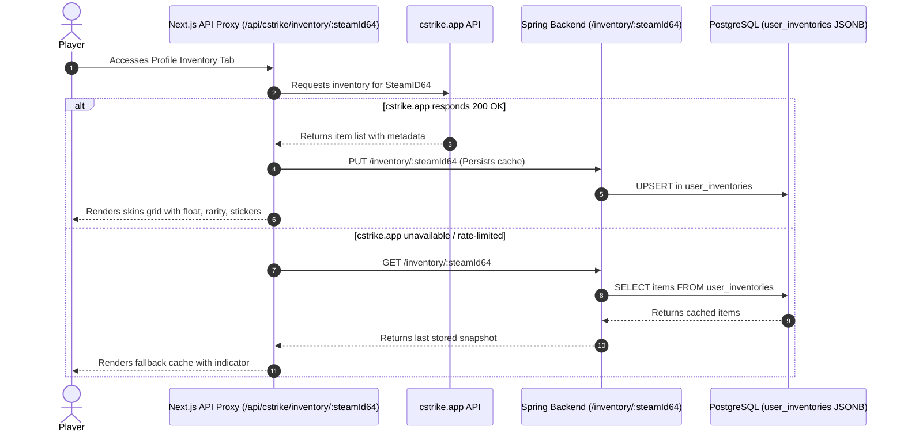

# CS2 Inventory Subsystem

> **Status note (20 August 2026):** the current inventory is a virtual simulator;
> the plugin only downloads/caches JSON and does not apply skins in CS2. See the
> [factual audit](./08_current_state_audit.md).

[← Return to Master Node](./00_index.md)

---

## 🎒 Overview

The CS2 inventory subsystem enables rich, high-performance display of knives, gloves, weapon skins, and stickers belonging to registered players.

---

## 🔄 Data Flow with cstrike.app



---

## 🗄️ Storage Schema (`user_inventories`)

```sql
CREATE TABLE user_inventories (
    user_id UUID PRIMARY KEY REFERENCES users(id) ON DELETE CASCADE,
    items JSONB NOT NULL DEFAULT '[]'::jsonb,
    created_at TIMESTAMPTZ NOT NULL DEFAULT NOW(),
    updated_at TIMESTAMPTZ NOT NULL DEFAULT NOW()
);
```
