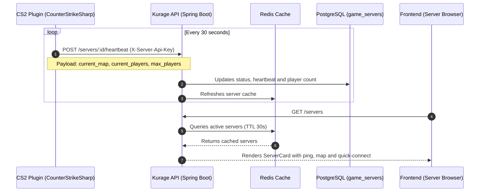

# CS2 Game Servers Subsystem

> **Status note (20 August 2026):** heartbeat/telemetry is a prototype, not a
> commercial control plane. Provisioning, tenancy, billing, and management are
> planned. See the [factual audit](./08_current_state_audit.md).

[← Return to Master Node](./00_index.md)

---

## 🎮 Overview

**Kurage** provides native integration for custom CS2 dedicated game servers, allowing real-time monitoring of maps, player counts, and server status.

---

## 🕹️ Supported Game Modes
1. **`RETAKE`**: Rapid post-plant scenario training with randomized utility loadouts.
2. **`DEATHMATCH`**: Free-For-All (FFA) instant respawn training.
3. **`COMPETITIVE_5V5`**: Official MR12 competitive scrims and matches.

---

## 📡 Heartbeat Protocol



---

## 🗄️ Database Table (`game_servers`)

```sql
CREATE TABLE game_servers (
    id UUID PRIMARY KEY DEFAULT gen_random_uuid(),
    name VARCHAR(100) NOT NULL UNIQUE,
    hostname VARCHAR(255) NOT NULL,
    port INT NOT NULL,
    game_mode VARCHAR(20) NOT NULL,
    current_map VARCHAR(50),
    current_players INT NOT NULL DEFAULT 0,
    max_players INT NOT NULL,
    is_online BOOLEAN NOT NULL DEFAULT false,
    last_heartbeat TIMESTAMPTZ,
    created_at TIMESTAMPTZ NOT NULL DEFAULT NOW(),
    updated_at TIMESTAMPTZ NOT NULL DEFAULT NOW()
);
```
