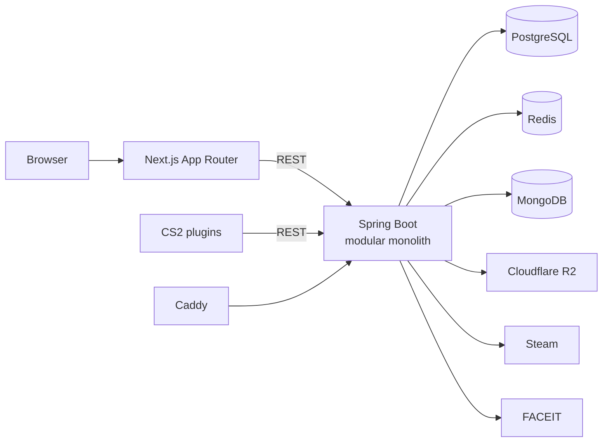
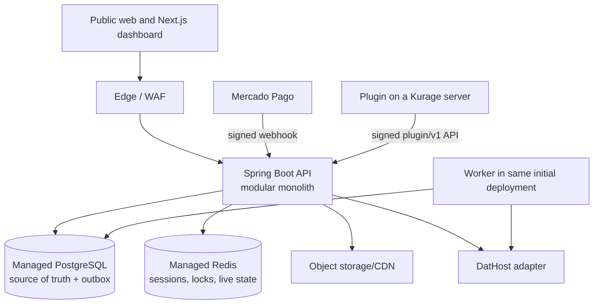

# Complete audit of Kurage's current state

**Baseline date:** 20 August 2026  
**Scope:** frontend, backend, data, authentication, integrations, CS2 plugins,
infrastructure, security, operations, product, quality, and Git readiness.  
**Classification:** technical alpha; not approved for production or billing.

## 1. Executive opinion

Kurage is already a technically meaningful portfolio project. It has a visually
distinct Next.js application, a substantial Spring Boot domain, Steam login,
rotating sessions, teams, rankings, a virtual inventory, server telemetry, and
CounterStrikeSharp plugins. The Java test suite is broad for this stage and passes
in full.

It is not yet an end-to-end sellable SaaS. The current code is a product foundation
with connected prototypes. The four links that would create the business — a
**valid match, an ELO update, a provisioned server, and a paid subscription** — do
not exist as one flow. Pricing buttons do not start checkout, the displayed server
has no tenant, no match updates ELO, and the inventory plugin does not apply items
inside the game.

Launch is also blocked by secret defaults, databases exposed on the host, a
fail-open heartbeat, Steam login without a one-time nonce, weak upload validation,
fabricated statistics in the frontend, local inventory that may cross accounts,
and missing privacy/operations/recovery controls.

**Decision:** keep a modular-monolith backend, complete one competitive loop, and
operate in Brazil first. Use Mercado Pago for billing and DatHost's API for game
server infrastructure. Do not build bare metal, a proprietary anti-cheat, or
microservices before measured usage requires them.

## 2. Audit method

- inventory of files and dependencies;
- cross-reading controllers, services, entities, migrations, hooks, routes,
  providers, pages, plugins, and manifests;
- static searches for contracts, authentication, secrets, URLs, uploads, and flags;
- test, lint, build, and Compose validation where possible;
- comparison between documentation, interface claims, and implemented behavior;
- public verification of documented domains;
- official-source research covering Steam, LGPD, software registration, GitHub,
  and the CounterStrikeSharp license.

Limitations:

- the workspace root had no `.git`; history, commit authorship, and past leaks
  could not be audited;
- local `.env` files exist and contain configured values; no value was included in
  or disclosed for this report;
- the integrated browser failed to start because of a trusted-runtime error, so
  automated visual QA was unavailable. Builds, routes, UI states, and code were
  still inspected;
- no .NET SDK, available local PostgreSQL for the startup probe, or dedicated CS2
  server was present;
- undisclosed private environments were out of scope.

## 3. Factual inventory

| Area | Current foundation |
|---|---|
| Backend | Java 21, Spring Boot 4.1.0, Maven, 124 main source files (~6.6k lines) |
| Frontend | Next.js 16.3.1, React 19.2.8, TypeScript, Tailwind 4, 97 TS/TSX files (~17.4k lines) |
| Plugins | C#/.NET 10, CounterStrikeSharp 1.0.371, `Kurage.Core` and `Kurage.Inventory` |
| Transactional store | PostgreSQL 16, JPA, Flyway |
| Ephemeral/cache | Redis 7 |
| Notifications | MongoDB 6 |
| Objects | Cloudflare R2 through its S3-compatible API |
| Integrations | Steam OpenID/Web API, FACEIT Data API, and `ip-api.com` |
| Edge/containers | Caddy and Docker Compose |

Generated artifacts (`target`, `.next`, `node_modules`, `bin`, `obj`, DLL/PDB, and
release output) were present, as were more than 1 GiB of thumbnails when duplicate
copies are counted. `frontend/public` contained 312 files totaling 760.55 MB;
`public/thumbs` accounted for 758.68 MB. Including the root `thumbs` folder, 441
files represented only 149 unique contents: 292 redundant copies, approximately
758.68 MiB.

The audit added defensive Git/Docker rules so secrets, build artifacts, and
obvious duplicate assets are not included in the first commit. The 149 canonical
PNGs still need AVIF/WebP derivatives and CDN/R2 delivery.

## 4. As-built architecture

The system is not a microservices architecture and does not implement SSE,
despite claims in older documents. It is a distributed set of components around
one API deployment. That is appropriate for the current stage because it reduces
deployment, consistency, and cognitive overhead. The API has implicit identity,
users, FACEIT, ranking, teams, inventory, notifications, and server modules, with
some coupling between services and stores.

### 4.1 Data ownership

| Store | Current content | Opinion |
|---|---|---|
| PostgreSQL | users, FACEIT, stats, teams, invitations, JSONB inventory, visits, servers, ranking snapshots | Make this the single transactional source |
| Redis | refresh families, rate limits, caches, and live rosters | Correct for ephemeral state; requires auth and HA |
| MongoDB | notifications | Unnecessary operational cost at this stage; migrate to PostgreSQL |
| R2 | avatars and logos | Suitable after validation/re-encoding and lifecycle controls |

There are no explicit commercial entities for `Subscription`, `Price`,
`PaymentEvent`, `Entitlement`, `ServerLease`, `UsageLedger`, `Match`,
`MatchParticipant`, or `AuditLog`. `subscriptionTier` is only a static user field.

## 5. End-to-end flows

### 5.1 Steam login and sessions

1. The frontend starts `GET /auth/steam`.
2. The API redirects to Steam OpenID.
3. The callback validates the response with Steam, fetches the profile, and creates
   or retrieves the user.
4. A device-bound refresh token is stored in Redis and sent as an
   HttpOnly/Secure/SameSite=Lax cookie.
5. The frontend calls `POST /auth/refresh`, receives a 15-minute access JWT, and
   keeps it in memory.
6. `apiFetch` retries once after a 401 and the backend rotates the refresh family.

Strengths include no access token in LocalStorage, short token lifetime, secure
cookies, rotation, and relative return-URL checks. Gaps include no browser-bound
one-time state/nonce, non-atomic Redis rotation, readable token keys in Redis,
claim-only authorization for up to 15 minutes, and excessive callback failure logs.

### 5.2 Profile, FACEIT, search, and ranking

Profiles and settings work, FACEIT synchronization exists, and ranking/snapshot
read paths are implemented. Header search exists, but no `/search` page does. The
ranking fetches a first window and filters locally. Backend ELO starts at 200, but
there is no match ingestion or operation that updates competitive statistics.

The frontend substitutes missing information with `#1`, ELO `2000`, rating `1.0`,
and synthetic chart points. Trust in data is central to this product, so unknown
data must render as unavailable or “calibrating,” never as an invented value.

### 5.3 Teams

The backend implements creation, membership, invitations, requests, expiring
links, roles, and ownership transfer. Management UI is absent and current links
target `/team/[tag]`, which does not exist. Concurrent requests may exceed link-use
limits or ownership invariants. Synchronous Mongo notification writes inside JPA
flows introduce partial-failure inconsistency.

### 5.4 Virtual inventory

The website creates, imports, equips, and stores a virtual JSONB inventory. Proxies
expose public inventory/equipped data. Cases and crafting are free client-side
simulations. The decided product model keeps this module **without monetary value,
paid random outcomes, cash-out, or prize promises**.

The provider uses one global LocalStorage key. If user A signs out and user B signs
in on the same browser with an empty remote inventory, A's items may remain and be
uploaded to B. Synchronization failures are silent. The C# plugin only downloads
and caches JSON; it does not change weapons, skins, `CEconItemView`, or loadout in
CS2.

### 5.5 Servers

`Kurage.Core` sends map and player data to `POST /servers/{id}/heartbeat`. The API
enriches the roster, stores live state in Redis, and marks a server offline after
two minutes. `/mar` polls the browser every eight seconds.

This is a telemetry demo, not a control plane. There is no owner/tenant, provider
ID, region, lifecycle, GSLT/RCON, provisioning, start/stop, configuration, usage
billing, quota, console, backups, capacity, or reconciliation. One global key
authenticates all servers and an empty configured key accepts heartbeats.
`css_mode` is available to any player and only changes a label, not actual gameplay.

### 5.6 Subscription

FREE, PLUS, PRO, and MAX cards show R$0/19/49/129, but their CTAs do nothing. There
is no checkout, webhook, invoice, trial, grace period, cancellation, refund, portal,
or reconciliation. `hasSubscriptionFeature` is unused and matrices in the home,
types, and settings disagree. “Verified Pro” is shown as a paid benefit even though
`isVerifiedPro` is a separate editorial property.

## 6. Maturity matrix

| Domain | State | What makes it ready |
|---|---|---|
| Identity | Technical beta | state/nonce, atomic session, account status, audit |
| Profile/FACEIT | Technical beta | timeouts, honest data, privacy, fault tolerance |
| Teams | Backend beta/UI absent | pages, concurrency invariants, E2E authorization |
| Ranking | Read prototype | match domain, versioned ELO, correct pagination |
| Inventory | Simulator beta | user isolation, bounded contract, optional real application |
| Servers | Telemetry prototype | control plane, tenancy, provider, credentials, usage ledger |
| Billing | Not implemented | Mercado Pago, idempotent inbox, reconciliation, entitlements |
| Operations | Development | CI/CD, secrets, observability, backup, restore, runbooks |
| Legal/compliance | Preparation | terms, privacy, AUP, retention, asset rights, registration |

## 7. Strengths

- differentiated, coherent visual language suitable for a portfolio;
- strict TypeScript and a valid production build;
- in-memory access token with HttpOnly refresh, stronger than persistent browser JWT;
- meaningful Java coverage across controllers, services, and authorization cases;
- Flyway and reasonably separated domain areas;
- rich team operations in the backend;
- Redis already supports sessions and live state;
- useful Next security headers/CSP and relative Steam return-URL validation;
- plugins demonstrate a real bridge between the game and the platform;
- existing bilingual material provides a base for accurate documentation.

## 8. P0 blockers — before publishing or charging

| ID | Finding and evidence | Required implementation |
|---|---|---|
| P0-01 | Known JWT fallback at `backend/docker-compose.yml:67`; empty secret defaults | Remove fallbacks, validate entropy at boot, rotate any deployed value |
| P0-02 | PostgreSQL/Redis/Mongo ports at `docker-compose.yml:11,24,38` | Private network, no public port mapping, authentication/TLS, firewall |
| P0-03 | Heartbeat fails open at `GameServerController.java:27-52` | Random per-server credential, DB hash, scope, revocation, fail closed |
| P0-04 | No match/ELO engine | Match/participants/idempotent result, versioned ELO, audit and disputes |
| P0-05 | Inert pricing CTAs at `frontend/src/app/page.tsx:404-534` | Do not sell until checkout, webhook, and entitlement work E2E |
| P0-06 | Cross-account inventory at `inventory-context.tsx:27,112-184` | User-keyed state, identity cleanup, debounce cancellation, ETag, visible errors |
| P0-07 | Steam login lacks state/nonce at `SteamAuthService.java:41-80` | Redis one-time nonce bound to browser/return URL, expiry, replay rejection |
| P0-08 | Non-atomic refresh at `RefreshTokenService.java:87-153` | Lua/atomic transaction, token hash, absolute family lifetime |
| P0-09 | Arbitrary public upload at `S3Service.java:28-67` | Size, magic bytes, decode/re-encode, dimensions, fixed MIME, lifecycle |
| P0-10 | IP sent over HTTP at `UserService.java:422-443` | Edge country header or local GeoIP; no raw IP transfer/logging |
| P0-11 | Profile invents `#1`, 2000, and rating 1.0 | Unknown/calibrating states, one ELO contract, real history only |
| P0-12 | Missing `/team`, `/teams`, `/search`, `/ranking/teams` routes | Implement required routes or remove links/sitemap entries |
| P0-13 | Lint fails with 85 errors and 86 warnings | Fix and make zero-warning/error lint a standalone CI gate |
| P0-14 | No terms, privacy, AUP, cancellation; footer links to `#` | Publish reviewed legal documents before commercial registration |
| P0-15 | Local `.env` files and no auditable Git history | Secret scan, rotate if copied, clean first commit, signed tags |
| P0-16 | Uniform proprietary license conflicts with CSS exception | Proprietary core, MIT `server/plugins`, notices/SBOM, legal review |

## 9. P1 risks — commercial MVP

1. **Incorrect pagination:** shrinking the last page changes the database offset
   (`RankingService.java:65-81,153-169`).
2. **Team concurrency:** invitation links and ownership transfer lack conditional
   updates/locks (`TeamService.java:448-530,680-705`).
3. **PostgreSQL + MongoDB:** no atomicity or outbox. Move notifications to
   PostgreSQL and publish events after commit.
4. **Blocking integrations:** Steam/FACEIT lack explicit resilience and FACEIT runs
   in a transaction (`UserService.java:340,390-417`).
5. **Rate limiting:** trusts the first `X-Forwarded-For` and fails open without
   Redis (`RateLimitInterceptor.java:58-64`).
6. **Plugin contract:** `/users`, `/servers`, and `/inventory` are unversioned;
   rank, clan tag, and ELO defaults disagree.
7. **C# lifecycle:** fire-and-forget tasks, concurrent unload, and unbounded `!sync`
   allow amplification and stale state.
8. **No tenancy:** every paid resource needs `ownerUserId` and database/API-enforced
   team-sharing policy.
9. **No control plane:** lease, desired/observed state, idempotency, provider cost,
   and compensation are absent.
10. **No billing domain:** webhook inbox, reconciliation, ledger, invoices, and
    entitlement transitions are absent.
11. **No backup/DR:** local volumes, non-persistent Redis, no restore test or RPO/RTO.
12. **No observability:** correlation IDs, tracing, SLOs, alerts, and business
    metrics are absent.
13. **Frontend public APIs:** hide upstream failures as empty arrays and lack
    timeout/rate limit/cache.
14. **Authorization:** feature access must come from server-side entitlements, not
    a client-displayed tier string.
15. **Privacy:** access/export/deletion, retention, and inventory/telemetry
    visibility must be defined before real collection.

## 10. Quality, performance, and UX — P2

- 53 of 77 TSX files are Client Components (68.8%); move home, ranking, mar, and
  profiles toward Server Components and scope inventory providers to their route.
- Deduplicate and transform 760 MB of assets; remove `unoptimized` and set budgets.
- Centralize polling in React Query or SSE; distinguish offline, stale, and error.
- Fix contrast, combobox semantics, keyboard cards, modal focus/ARIA, and reduced
  motion to meet WCAG 2.2 AA.
- Fix per-route canonical, duplicate titles, OG images, sitemap, and 404/503 states.
- Remove `any`, dead code, unused dependencies, and 40–58 KB monolithic files.
- Restrict `apiFetch` to relative/approved origins so bearer/cookies cannot leak.
- Add runtime DTO validation and a consistent error contract.
- Remove hard-coded tickrate/scores and display factual telemetry.
- Add server-side pagination, `pg_trgm` indexes, and projections for search/ranking.

## 11. Validation results

| Check | Result |
|---|---|
| Backend Maven tests | 22 suites, 137 tests, 0 failures, 0 errors, 0 skipped |
| Backend package | Success; ~89.5 MB JAR |
| Dev/prod Compose `config --quiet` | Success |
| Full startup | Not validated; probe stopped without local PostgreSQL |
| Frontend `npm run build` | Success; 10 static pages generated |
| Frontend `npm test` | 19/19 passing across 4 unit suites |
| Frontend `npm run lint` | Failed: 85 errors and 86 warnings |
| C# plugins | Static review; no .NET SDK for build |
| Visual browser QA | Integrated runtime unavailable |
| Public production | main domain returned 404; API/www/play had no DNS resolution on baseline date |

Java tests use H2 and mocked Mongo. Testcontainers, real Flyway, concurrency,
contracts, E2E, load, dedicated CS2, billing, restore, and chaos tests are missing.

## 12. Approved target architecture

Internal modules:

- `identity`: Steam, sessions, users, consent, account status;
- `competitive`: matches, participants, ELO, seasons, ranking, disputes;
- `teams`: members, roles, primary team, sharing;
- `inventory`: user-isolated virtual simulator and preferences;
- `controlplane`: server template, lease, desired/observed state, usage;
- `billing`: catalog, customer, subscription, payment inbox, reconciliation;
- `entitlements`: authoritative projection derived from billing;
- `notifications`: PostgreSQL table plus outbox;
- `audit`: administrative, financial, and match-result actions.

Do not extract microservices now. A worker may use the same artifact with outbox
and locks. Extract a module only when scale, availability, team ownership, or
compliance creates a measurable boundary.

### 12.1 Defined control plane

- initial region: São Paulo;
- infrastructure: DatHost API;
- commercial resource: temporary `ServerLease`, owned by a subscriber and
  optionally shared with one team;
- usage: prepaid metered credits, never an “unlimited” promise;
- states: `REQUESTED → PROVISIONING → RUNNING → STOPPING → STOPPED → FAILED → TERMINATED`;
- idempotent commands with desired/observed state and reconciliation;
- encrypted GSLT/RCON, never sent to the browser; one credential per server;
- inactivity auto-stop and immutable minute/cost ledger;
- plugin access only through `/plugin/v1`, bound to the lease credential.

### 12.2 Defined match/ELO authority

A Kurage-operated server is the result authority. On completion:

1. the plugin sends signed `matchId`, roster, rounds, score, and nonce;
2. the API records the event in an inbox with an idempotency key;
3. lease, roster, and sequence are validated;
4. result and algorithm version are persisted in one transaction;
5. ELO/ranking are updated and an outbox event is published;
6. the raw event and audit trail remain available for disputes/reprocessing.

ELO starts at 200 and uses one 0–1000 / level 1–10 scale. Formula, placements,
decay, and anti-smurf behavior must be a versioned ADR before implementation.

## 13. Implementation plan and acceptance criteria

### Stage 0 — days 0–30: trust and truth

- complete P0-01 through P0-16;
- mandatory CI lint, test, build, and scan;
- Testcontainers for PostgreSQL/Redis and notification migration from Mongo;
- reviewed privacy notice, terms, AUP, and cancellation policy;
- unimplemented pages removed from indexing;
- no UI renders invented data;
- automatic backup and documented restore test;
- secrets manager, secret scan, and release SBOM.

**Exit:** trustworthy private demo with no payments.

### Stage 1 — days 31–90: competitive loop

- complete team UI and primary-team selection;
- Match domain, signed ingestion, transactional ELO;
- secure `/plugin/v1` and Core plugin;
- DatHost adapter, lease, start/stop/status, minimum dashboard;
- factual telemetry with error/stale/offline states;
- Steam → team → server → match → ELO E2E.

**Exit:** five design-partner teams complete instrumented matches every week.

### Stage 2 — days 91–180: revenue

- one catalog and backend entitlements;
- Mercado Pago customer/subscription/webhook inbox/reconciliation;
- `/settings/billing`, checkout, portal, and cancellation;
- server credits, ledger, alerts, and auto-stop;
- invoices/receipts, payment failure, grace period, support;
- conversion, hourly margin, and churn metrics.

**Exit:** accept the first real subscription only after production gate approval.

### Stage 3 — days 181–365: maturity

- seasons, advanced history, disputes, fraud controls;
- tournaments/communities only after retention is proven;
- additional regions only with demand;
- SLOs, tracing, capacity planning, DR, load testing;
- scoped and rate-limited API/export for MAX.

## 14. Recorded business and architecture decisions

These are the single approved choices, not parallel options:

| Topic | Decision |
|---|---|
| Initial users | 18+ captains/players on amateur and semi-professional Brazilian teams |
| Promise | identity + team operation + on-demand server + verifiable result |
| Backend | Spring Boot modular monolith |
| Transactional source | PostgreSQL; MongoDB will be removed |
| Payments | Mercado Pago in BRL |
| Servers | DatHost API, São Paulo first, prepaid hours |
| Match authority | Kurage server + signed, idempotent final event |
| Inventory | free virtual simulator, private by default, no value/cash-out |
| Pro verification | editorial/manual, never purchasable |
| Public telemetry | ranked result public; live/raw minimized with explicit retention |
| Repository | private canonical repo; sanitized public case study; temporary recruiter access |
| Licensing | proprietary core; MIT plugins for compatibility |

## 15. Production gate

The first payment may be accepted only when all items are green:

- zero open P0 and lint/test/build/scan pass on an attributable signed commit;
- unique secrets, tested rotation, and no public database;
- demonstrated backup restore with defined RPO/RTO;
- payment/webhook/entitlement/cancellation/refund E2E;
- provisioning/usage/stop/metering/provider-cost reconciliation E2E;
- negative tenant-authorization tests;
- published terms, privacy, AUP, support, and incident response;
- no fabricated inventory or statistics;
- availability, error, latency, queue, margin, and fraud monitoring;
- asset/trademark rights review completed;
- practiced application and migration rollback.

## 16. Conclusion

Kurage demonstrates full-stack breadth, external integrations, thoughtful session
security, domain modeling, and visual craft—strong portfolio material when
presented honestly. The greatest gain now will not come from more pages, but from
closing one trustworthy loop: **a team starts a session, a server runs a match,
the backend validates the result, ELO changes, and the subscriber sees value**.

This audit is the factual baseline for 20 August 2026. Documents 01–07 describe
components and intentions, but must be read through this audit until updated in
the same change as each implementation.

