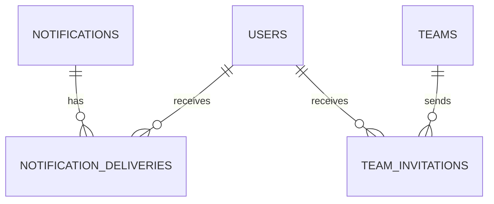

# PostgreSQL Notifications

> **Status: implemented on 21 August 2026.** Migration
> `V4__notifications_in_postgres.sql` removes MongoDB as an operational
> dependency and makes PostgreSQL the single transactional source for
> notifications and invitations.

[← Index](./00_index.md)

## Decision and boundaries

MongoDB was removed from the backend, Compose files, environment variables, and
tests. Notifications now live in PostgreSQL alongside team flows. This removes an
operational dependency while retaining flexibility: content has an open `type`,
JSONB metadata, and an action URL.

Invitations, join requests, and invite links are **not notifications**. They stay
in `team_invitations`, `team_join_requests`, and `team_invite_links`, which own
their expiry, status, permissions, and business invariants. A notification only
informs the user and references the actionable entity through `metadata`.

## Current model

- `notifications` stores immutable, reusable content.
- `notification_deliveries` stores the inbox: recipient, delivery time, and read
  state. `(notification_id, user_id)` is unique to prevent duplicates.
- The API exposes a delivery ID; `PATCH /notifications/{id}/read` changes only
  that user's read state. `PATCH /notifications/read-all` performs a scoped bulk
  update.
- Expired messages are hidden from the inbox. User/date and partial-unread
  indexes exist, and page sizes are capped at 100.
- Priority ranges from 0 to 3. `metadata` carries UI context such as `teamId`,
  `inviteId`, or a campaign identifier; it never replaces domain state.

The available taxonomy includes team, system, announcement, suggestion,
discovery, and friendship events. The service also accepts short validated custom
types such as `campaign.weekly_digest` or `friend.request`, avoiding schema
changes for each feature. Storage normalizes the type to uppercase for consistent
queries.

## Implemented flows

Existing team actions create PostgreSQL notifications for team creation,
invitations, join requests, approval/rejection, invite-link usage, and role
changes. Each event creates content and delivery in the same database, while the
invitation/request record remains the source of truth for acceptance, rejection,
or expiry.

The service can also send to a bounded audience: one content row plus one delivery
per deduplicated user. This is appropriate for a team, closed beta, or small
announcement.

## Growth without redesign

### Announcements, campaigns, and suggestions

For banners, platform facts, internal advertising, or suggestions, use a
namespaced type, `action_url`, priority, expiry, and a campaign ID in `metadata`.
Do not fan out millions of rows inside an HTTP request.

At that scale, introduce a `campaigns` module and worker with versioned,
auditable segmentation; idempotent batched delivery creation via `INSERT ...
SELECT` or queues; a PostgreSQL outbox for push/email/websocket; delivery/read/
opt-out metrics; and channel limits plus LGPD consent review.

The existing tables remain the inbox and read source; the worker becomes the
asynchronous producer, not a second database.

### Future friendships

Friendship needs its own PostgreSQL state, for example `friend_requests` and
`friendships`, with requester, recipient, status, timestamps, uniqueness, and
blocks. `FRIEND_REQUEST` and `FRIEND_REQUEST_ACCEPTED` are UI events only. The UI
must query the friendship relationship to act; it must never infer authorization
from a read or expired notification.

## Deployment and legacy data

Flyway runs V4 automatically. Before removing any old MongoDB volume, take a
backup and inventory. This change neither deletes volumes nor automatically
migrates documents because a legacy document can contain fields and IDs that do
not have a verifiable production mapping.

If data must be retained, run a one-time maintenance migration: export and freeze
the Mongo collection; validate every `userId` against `users.id`; convert each
document to one `notifications` row and one `notification_deliveries` row while
preserving `createdAt` and mapping `isRead` to `read_at`; then validate per-user
counts and metadata samples before retiring the old volume under the backup
policy.

No production data was supplied, so no data deletion or import was performed in
this repository.

## Operations and next controls

- The profile offers optional, private contact channels (`email` and
  `phone_e164`) only through `/users/me/contact`; they are not serialized in a
  public profile, search, or profile cache. Phone is stored as E.164, and blank
  fields remove their respective channel.
- No email or WhatsApp delivery is active. Before enabling either channel,
  implement proof of ownership, per-channel/per-purpose opt-in, opt-out,
  frequency limits, consent records, and LGPD-approved providers.
- Define retention and an auditable purge job before broad campaigns.
- PostgreSQL + Redis Testcontainers coverage validates JSONB, indexes, and V4
  against the real database; H2 was removed. See the [testing strategy](./11_integration_testing.md).
- Add an outbox before push, email, or websocket delivery requirements.
- Authorize administrative campaign senders and audit who sent which message to
  which segment and why.
