# Ecossistema Kurage — índice da documentação

[English index](../en/00_index.md)

## Estado e regra de manutenção

Kurage está em **alfa técnica**. Não há produção pública ou cobrança validada na
data-base de 20/08/2026. A
[auditoria do estado atual](./08_auditoria_estado_atual.md) é a referência factual
para o que está implementado, incompleto ou planejado. Os documentos 01–07 são
referências de componentes e intenção; qualquer divergência deve ser corrigida no
mesmo pull request da implementação.

Cada documento novo deve indicar explicitamente:

- **implementado:** existe no código e foi validado;
- **protótipo:** existe parcialmente e não sustenta promessa comercial;
- **planejado:** ainda não existe;
- data/commit da última validação.

## Visão do sistema

Kurage é um SaaS proprietário em desenvolvimento para identidade competitiva,
operação de times, servidores privados sob demanda e resultados verificáveis de
Counter-Strike 2. O backend atual é um monólito modular Spring Boot consumido por
um frontend Next.js e por plugins CounterStrikeSharp.

```mermaid
flowchart TD
    A[00 — Índice] --> B[08 — Auditoria factual]
    A --> C[09 — Produto e mercado]
    A --> K[10 — Notificações PostgreSQL]
    A --> L[11 — Testes de integração]
    A --> M[12 — Plano Maré]
    A --> N[13 — Autenticação e segurança]
    A --> O[14 — Consistência e observabilidade]
    A --> P[15 — Operação e release]
    A --> Q[16 — Prontidão jurídica]
    A --> R[17 — Deploy OCI e Vercel]
    A --> D[01 — Arquitetura atual/intenção]
    A --> E[02 — Backend]
    A --> F[03 — Frontend]
    A --> G[04 — Inventário]
    A --> H[05 — Servidores]
    A --> I[06 — Integrações]
    A --> J[07 — Design system]
```

## Documentos

1. [Arquitetura e infraestrutura](./01_architecture_infrastructure.md)
2. [Core do backend](./02_backend_core.md)
3. [Core do frontend](./03_frontend_core.md)
4. [Subsistema de inventário CS2](./04_cs2_inventory_subsystem.md)
5. [Subsistema de servidores CS2](./05_game_servers_subsystem.md)
6. [Integrações externas](./06_external_integrations.md)
7. [Design system](./07_frontend_design_system.md)
8. [Auditoria completa do estado atual](./08_auditoria_estado_atual.md)
9. [Produto, mercado, monetização e portfólio](./09_produto_mercado.md)
10. [Notificações no PostgreSQL](./10_notificacoes_postgres.md)
11. [Estratégia de testes com serviços reais](./11_testes_integracao.md)
12. [Plano Maré](./12_plano_mare.md)
13. [Autenticação, sessão e fronteira de confiança](./13_autenticacao_seguranca.md)
14. [Consistência transacional e observabilidade](./14_consistencia_observabilidade.md)
15. [Operação, recuperação e gate de release](./15_operacao_e_release.md)
16. [Prontidão jurídica e de privacidade](./16_prontidao_juridica.md)
17. [Deploy da alfa na OCI e Vercel](./17_deploy_alpha_oci_vercel.md)
18. [Branches, pull requests e CI/CD](./18_branches_prs_ci.md)

## Documentos do repositório

- [README principal](../../README.md)
- [Licença proprietária](../../LICENSE)
- [Licença MIT dos plugins](../../server/plugins/LICENSE)
- [Avisos de terceiros](../../THIRD_PARTY_NOTICES.md)
- [Política de segurança](../../SECURITY.md)
- [Política de contribuição](../../CONTRIBUTING.md)

Os domínios `kurage.caiomayan.com` e `api.caiomayan.com` são o contrato preparado
para a alfa, mas só constituem produção operacional depois do primeiro deploy e
dos gates descritos no documento 17.
