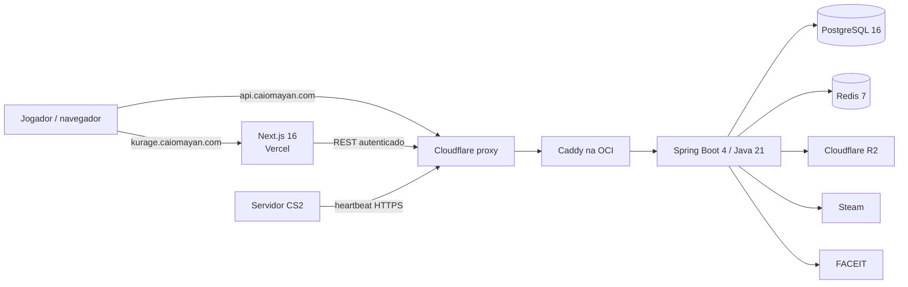

# Arquitetura e infraestrutura

> **Estado em 29/08/2026:** topologia da alfa implementada no repositório, ainda
> não aplicada às contas externas. A [auditoria factual](./08_auditoria_estado_atual.md)
> continua sendo a fonte sobre prontidão funcional.

[← Voltar ao índice](./00_index.md)

## Topologia adotada

Kurage usa um monólito modular, não microserviços. O navegador carrega o Next.js
pela Vercel e consome a API pública através da Cloudflare. A API e os dois bancos
ficam numa única VM OCI durante a alfa.

## Componentes

### Frontend

- Vercel ligada ao repositório GitHub, com raiz `frontend`.
- Domínio de alfa: `kurage.caiomayan.com`.
- Variáveis públicas apontam para `https://api.caiomayan.com`.
- Previews não recebem CORS autenticado por wildcard; um preview autenticado
  precisa de hostname estável explicitamente autorizado.

### Backend e dados

- OCI `VM.Standard.A1.Flex`, ARM64, 2 OCPUs, 6 GB e Ubuntu 24.04.
- Caddy expõe somente 80/443; Spring, PostgreSQL e Redis ficam na rede Compose.
- PostgreSQL é o armazenamento transacional, inclusive inventário, times,
  convites e notificações.
- Redis guarda sessões efêmeras, revogação, rate limit e cache.
- Pool PostgreSQL de produção: máximo 10, mínimo ocioso 2.
- Limites preparados: API 1,6 GB, PostgreSQL 1,2 GB, Redis 384 MB e Caddy 256 MB.

### Rede e confiança

- `api.caiomayan.com` é um A proxied da Cloudflare para o IP OCI reservado.
- O NSG aceita 80/443 somente das faixas IPv4 publicadas pela Cloudflare.
- Caddy só confia em `CF-Connecting-IP` quando o peer é da Cloudflare.
- SSH usa chave dedicada, sem senha e sem root. A exposição temporária para IPs
  dinâmicos dos runners GitHub está registrada como trade-off da alfa.

### Entrega

- Terraform 1.12+ usa backend OCI Object Storage com lock e versionamento.
- GitHub Actions testa antes de publicar uma imagem GHCR ARM64/AMD64.
- A VM recebe o digest imutável da imagem e faz rollback se a API não ficar
  saudável.
- O contrato de execução é Docker Compose; apenas o módulo Terraform depende da
  Oracle.

## Operação

Consulte o [deploy da alfa](./17_deploy_alpha_oci_vercel.md) e o
[`infra/README.md`](../../infra/README.md) para credenciais, DNS, primeiro apply,
release e migração. Backup externo e restore real continuam gates obrigatórios.
