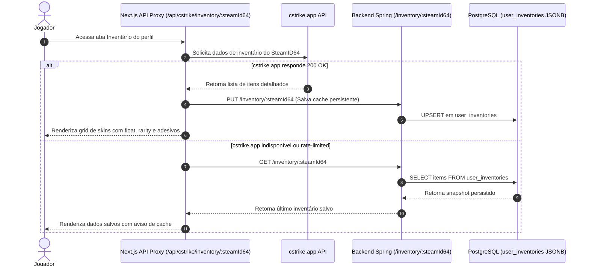

# Subsistema de Inventário CS2

> **Nota de estado (20/08/2026):** o inventário atual é um simulador virtual; o
> plugin apenas baixa/cacheia JSON e não aplica skins no CS2. Consulte a
> [auditoria factual](./08_auditoria_estado_atual.md).

[← Retornar ao Master Node](./00_index.md)

---

## 🎒 Visão Geral

O subsistema de inventário permite a visualização ultra-rápida e rica em detalhes das skins, facas, luvas e adesivos de Counter-Strike 2 pertencentes aos jogadores cadastrados.

---

## 🔄 Fluxo de Dados e Integração com cstrike.app



---

## 🗄️ Estrutura de Armazenamento (`user_inventories`)

```sql
CREATE TABLE user_inventories (
    user_id UUID PRIMARY KEY REFERENCES users(id) ON DELETE CASCADE,
    items JSONB NOT NULL DEFAULT '[]'::jsonb,
    created_at TIMESTAMPTZ NOT NULL DEFAULT NOW(),
    updated_at TIMESTAMPTZ NOT NULL DEFAULT NOW()
);
```

- Os itens são persistidos como JSONB contendo metadados essenciais (nome do item, skin, desgaste/float, stickers aplicados, raridade e imagem).
- Permite renderização offline ou em fallback caso serviços externos fiquem fora do ar.
