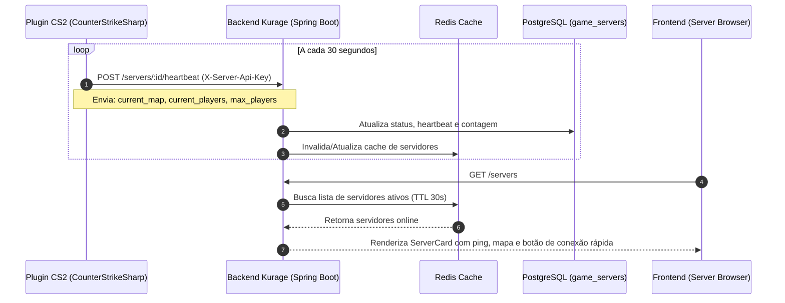

# Subsistema de Servidores de CS2

> **Nota de estado (20/08/2026):** existe heartbeat/telemetria de protótipo, não um
> control plane comercial. Provisionamento, tenancy, cobrança e gestão ainda são
> planejados. Veja a [auditoria factual](./08_auditoria_estado_atual.md).

[← Retornar ao Master Node](./00_index.md)

---

## 🎮 Visão Geral

O **Kurage** integra um ecossistema próprio de servidores dedicados de Counter-Strike 2, permitindo que a comunidade jogue em modos competitivos e de treino personalizados, enquanto o portal monitora o status, jogadores conectados e mapas em tempo real.

---

## 🕹️ Modos de Jogo Suportados
1. **`RETAKE`**: Simulação rápida de situações pós-plant com kits de utilitários aleatórios.
2. **`DEATHMATCH`**: Modo Deathmatch Free-For-All (FFA) com respawn instantâneo para treino de mira.
3. **`COMPETITIVE_5V5`**: Partidas e scrims fechadas no formato competitivo oficial de CS2 (MR12).

---

## 📡 Protocolo de Heartbeat & Comunicação



---

## 🗄️ Tabela `game_servers`

```sql
CREATE TABLE game_servers (
    id UUID PRIMARY KEY DEFAULT gen_random_uuid(),
    name VARCHAR(100) NOT NULL UNIQUE,
    hostname VARCHAR(255) NOT NULL,
    port INT NOT NULL,
    game_mode VARCHAR(20) NOT NULL,
    current_map VARCHAR(50),
    current_players INT NOT NULL DEFAULT 0,
    max_players INT NOT NULL,
    is_online BOOLEAN NOT NULL DEFAULT false,
    last_heartbeat TIMESTAMPTZ,
    created_at TIMESTAMPTZ NOT NULL DEFAULT NOW(),
    updated_at TIMESTAMPTZ NOT NULL DEFAULT NOW()
);
```

- Se um servidor não enviar heartbeat por mais de 2 minutos, uma rotina em background (`@Scheduled`) marca o servidor como `is_online = false`.
