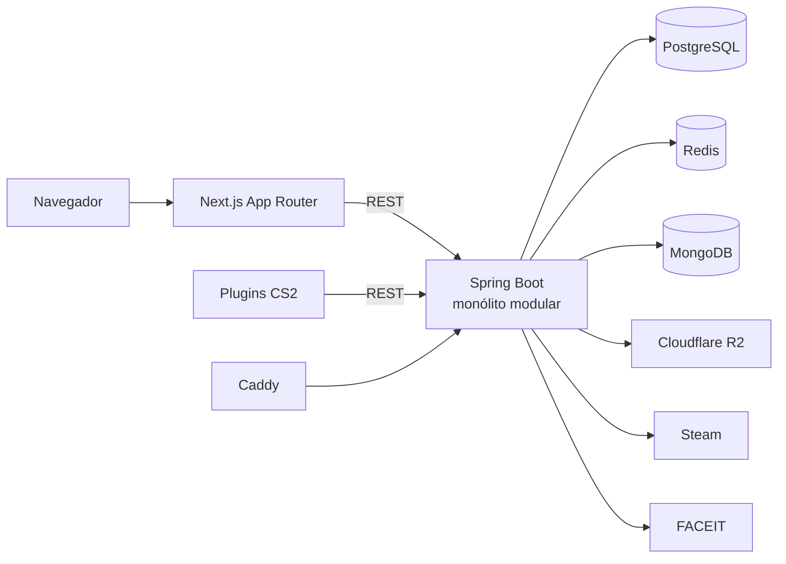
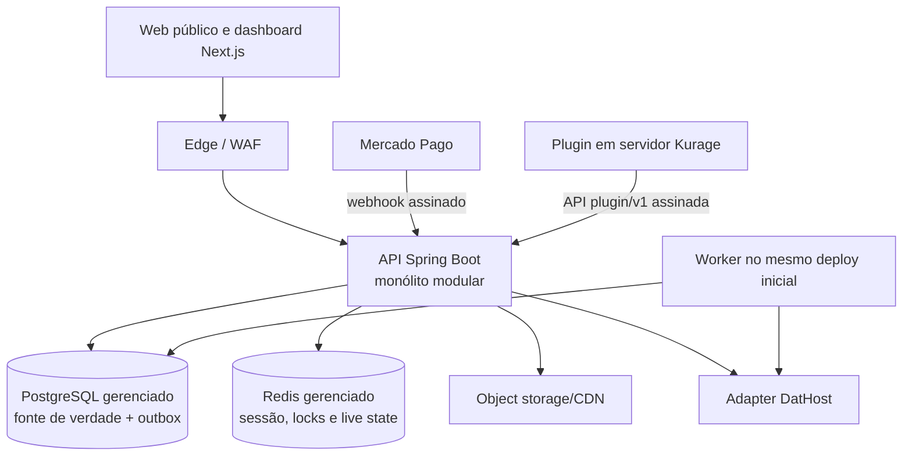

# Auditoria completa do estado atual do Kurage

**Data-base:** 20 de agosto de 2026  
**Escopo:** frontend, backend, dados, autenticação, integrações, plugins CS2,
infraestrutura, segurança, operação, produto, qualidade e prontidão para Git.  
**Classificação:** alfa técnica; não aprovado para produção ou cobrança.

## 1. Parecer executivo

Kurage já é um portfólio tecnicamente relevante: há uma aplicação Next.js de boa
qualidade visual, um backend Spring Boot com domínio substancial, autenticação
Steam, sessões rotativas, times, rankings, inventário virtual, telemetria de
servidor e plugins CounterStrikeSharp. A suíte Java é ampla para o estágio e passa
integralmente.

Ainda não existe, porém, um SaaS vendável de ponta a ponta. O código atual é uma
base de produto com protótipos conectados. Os quatro elos que formariam o negócio
— **partida válida, atualização de ELO, servidor provisionado e assinatura paga**
— não estão implementados como um único fluxo. A interface vende planos cujos
botões não executam checkout, o servidor exibido não pertence a um tenant, o ELO
não recebe resultado de partida e o plugin de inventário não aplica itens no jogo.

O lançamento também está bloqueado por defaults de segredo, bancos publicados no
host, heartbeat fail-open, login Steam sem nonce de uso único, upload sem validação
forte, dados estatísticos artificiais no frontend, inventário local que pode
atravessar contas e ausência de LGPD/operação/recuperação.

**Decisão:** manter o backend como monólito modular, concluir um único loop
competitivo e operar inicialmente no Brasil. Usar Mercado Pago para cobrança e
DatHost como infraestrutura de servidores por API. Não construir bare metal,
anti-cheat próprio ou microserviços antes de haver uso que justifique isso.

## 2. Como a auditoria foi feita

- inventário de arquivos e dependências;
- leitura cruzada de controllers, services, entidades, migrations, hooks, páginas,
  providers, rotas, plugins e manifests;
- busca estática de contratos, autenticação, secrets, URLs, uploads e flags;
- execução de testes, lint, builds e validação dos Compose quando possível;
- comparação entre documentação, interface e comportamento implementado;
- verificação pública dos domínios documentados;
- consulta a fontes oficiais sobre Steam, LGPD, registro de software, GitHub e
  licença CounterStrikeSharp.

Limitações:

- a raiz recebida não continha `.git`; histórico, autoria de commits e vazamentos
  anteriores não puderam ser auditados;
- arquivos `.env` locais existem e contêm valores configurados; nenhum valor foi
  lido para o relatório ou reproduzido;
- o browser integrado não iniciou por falha no runtime confiável, portanto não
  houve QA visual automatizado. Build, rotas, estados e código foram inspecionados;
- não havia SDK .NET, Postgres local disponível no probe nem servidor CS2 dedicado;
- ambientes privados não informados ficaram fora do escopo.

## 3. Inventário factual

| Área | Base atual |
|---|---|
| Backend | Java 21, Spring Boot 4.1.0, Maven, 124 fontes principais (~6,6 mil linhas) |
| Frontend | Next.js 16.3.1, React 19.2.8, TypeScript, Tailwind 4, 97 fontes TS/TSX (~17,4 mil linhas) |
| Plugins | C#/.NET 10, CounterStrikeSharp 1.0.371, `Kurage.Core` e `Kurage.Inventory` |
| Transacional | PostgreSQL 16, JPA e Flyway |
| Efêmero/cache | Redis 7 |
| Notificações | MongoDB 6 |
| Objetos | Cloudflare R2 via API S3 |
| Integrações | Steam OpenID/Web API, FACEIT Data API e `ip-api.com` |
| Edge/containers | Caddy e Docker Compose |

Foram encontrados artefatos gerados (`target`, `.next`, `node_modules`, `bin`,
`obj`, DLL/PDB e releases) e mais de 1 GiB de thumbnails contando duplicações. Em
`frontend/public`, 312 arquivos ocupavam 760,55 MB; `public/thumbs` respondia por
758,68 MB. Considerando também a pasta `thumbs` da raiz, havia 441 arquivos para
apenas 149 conteúdos únicos: 292 cópias redundantes, aproximadamente 758,68 MiB.

A auditoria adicionou regras defensivas de Git/Docker para evitar secrets,
artefatos e duplicações evidentes no primeiro commit. Os 149 PNGs canônicos ainda
devem ser convertidos para AVIF/WebP e movidos para CDN/R2.

## 4. Arquitetura como construída

O sistema não é microserviços e não possui SSE, apesar de documentos antigos
afirmarem isso. É um conjunto distribuído com uma API monolítica. Para esta fase,
isso reduz custo cognitivo, deploys e falhas distribuídas. A API contém módulos
implícitos de identidade, usuários, FACEIT, ranking, times, inventário,
notificações e servidores, mas ainda há acoplamento entre serviços e stores.

### 4.1 Responsabilidade dos dados

| Store | Conteúdo atual | Parecer |
|---|---|---|
| PostgreSQL | usuários, FACEIT, stats, times, convites, inventários JSONB, visitas, servidores e snapshots | Deve ser a fonte transacional única |
| Redis | refresh tokens, famílias de sessão, rate limit, caches e roster live | Correto para dados efêmeros; precisa HA e autenticação |
| MongoDB | notificações | Custo operacional desnecessário no estágio atual; migrar para Postgres |
| R2 | avatars e logos | Adequado após validação/reencode e política de lifecycle |

Não existem entidades comerciais de `Subscription`, `Price`, `PaymentEvent`,
`Entitlement`, `ServerLease`, `UsageLedger`, `Match`, `MatchParticipant` ou
`AuditLog`. `subscriptionTier` é apenas um atributo estático do usuário.

## 5. Fluxos ponta a ponta

### 5.1 Login Steam e sessão

1. O frontend inicia `GET /auth/steam`.
2. A API redireciona ao Steam OpenID.
3. O callback valida a resposta junto ao Steam, consulta o perfil e cria ou
   recupera o usuário.
4. Um refresh token vinculado ao dispositivo é armazenado no Redis e enviado em
   cookie HttpOnly/Secure/SameSite=Lax.
5. O frontend chama `POST /auth/refresh`, recebe access token JWT de 15 minutos e o
   mantém em memória.
6. `apiFetch` repete uma vez após 401 e o backend rotaciona a família de refresh.

Pontos fortes: access token não vai para LocalStorage, token curto, cookie seguro,
rotação e proteção de URL de retorno. Lacunas: não há state/nonce one-time ligado
ao navegador; a rotação Redis não é atômica; tokens são chaves legíveis no Redis;
o filtro confia apenas nos claims até 15 minutos; o callback registra informação
demais em falha.

### 5.2 Perfil, FACEIT, busca e ranking

Perfis e configurações funcionam, o FACEIT é sincronizado e há ranking/leitura de
snapshots. O header possui busca, mas não há página `/search`. O ranking limita a
primeira janela e filtra no cliente. O backend inicializa o ELO em 200, porém não
há ingestão de partida nem operação que atualize estatísticas competitivas.

O frontend mascara ausência com `#1`, ELO `2000`, rating `1.0` e pontos de gráfico
fabricados. Isso é especialmente grave porque a confiança no dado é o núcleo da
proposta. Indisponível deve ser mostrado como indisponível ou “em calibração”.

### 5.3 Times

O backend implementa criação, membros, convites, solicitações, links expiráveis,
papéis e transferência. A UI de gestão não existe e os links atuais apontam para
`/team/[tag]`, rota ausente. Concorrência pode ultrapassar usos máximos de link e
violar invariantes de ownership. Notificação Mongo síncrona dentro do fluxo JPA
cria inconsistência em falha parcial.

### 5.4 Inventário virtual

O site cria, importa, equipa e persiste um inventário virtual JSONB. Há proxies
para dados públicos de inventário/equipados. Caixas e crafting são simulações
client-side gratuitas. O produto definido manterá esse módulo **sem valor
monetário, compra aleatória, cash-out ou promessa de prêmio**.

O provider usa uma chave LocalStorage global. Se A sair e B entrar no mesmo
navegador com inventário remoto vazio, itens de A podem permanecer e ser gravados
em B. Erros de sincronização são silenciosos. O plugin C# apenas baixa e guarda o
JSON; não altera arma, skin, `CEconItemView` ou loadout dentro do CS2.

### 5.5 Servidores

`Kurage.Core` envia mapa e jogadores para `POST /servers/{id}/heartbeat`. A API
enriquece o roster, guarda estado live no Redis e marca offline após dois minutos.
`/mar` consulta o browser a cada oito segundos.

Hoje existe apenas telemetria de demonstração. Não há proprietário/tenant,
provider ID, região, ciclo de vida, GSLT/RCON, provisionamento, start/stop,
configuração, cobrança por uso, quotas, console, backups, capacidade ou reconciliação.
Uma chave global autentica todos os servidores e, se estiver vazia, o heartbeat é
aceito. `css_mode` pode ser usado por qualquer jogador e apenas muda o rótulo, não
o modo real.

### 5.6 Assinatura

Os cards FREE, PLUS, PRO e MAX mostram R$ 0/19/49/129, mas os CTAs não têm ação.
Não há checkout, webhook, invoice, trial, grace period, cancelamento, reembolso,
portal ou conciliação. `hasSubscriptionFeature` não é aplicado e as matrizes da
home, tipos e configurações se contradizem. “Selo Verificado Pro” aparece como
benefício pago, apesar de `isVerifiedPro` ser um atributo editorial separado.

## 6. Matriz de maturidade

| Domínio | Estado | Para ficar pronto |
|---|---|---|
| Identidade | Beta técnico | nonce/state, sessão atômica, account status e auditoria |
| Perfil/FACEIT | Beta técnico | timeouts, dados honestos, privacidade e tolerância a falhas |
| Times | Backend beta/UI ausente | páginas, invariantes concorrentes e autorização E2E |
| Ranking | Leitura protótipo | domínio de partidas, ELO versionado e paginação correta |
| Inventário | Simulador beta | isolamento por usuário, contrato/limites e aplicação real opcional |
| Servidores | Telemetria protótipo | control plane, tenant, provider, credenciais e usage ledger |
| Billing | Não implementado | Mercado Pago, inbox idempotente, reconciliação e entitlements |
| Operação | Desenvolvimento | CI/CD, secrets, observabilidade, backup, restore e runbooks |
| Legal/compliance | Preparação | termos, privacidade, AUP, retenção, direitos de ativos e registro |

## 7. Pontos fortes

- linguagem visual distinta e consistente, útil para portfólio;
- TypeScript strict e build de produção válido;
- token de acesso em memória e refresh HttpOnly, melhor que JWT persistente no
  browser;
- cobertura Java relevante: controllers, services e casos de autorização;
- Flyway e separação razoável dos domínios;
- times possuem um conjunto rico de operações;
- Redis já é usado para sessão e live state;
- headers/CSP no Next e validação relativa do retorno Steam formam boas bases;
- plugins demonstram integração real entre jogo e plataforma;
- documentação bilíngue existente fornece material para ser corrigido e evoluído.

## 8. Bloqueadores P0 — antes de publicar ou cobrar

| ID | Achado e evidência | Implementação obrigatória |
|---|---|---|
| P0-01 | JWT fallback conhecido em `backend/docker-compose.yml:67`; secrets vazios aceitos | Remover todo fallback, validar entropia no boot e rotacionar qualquer valor já usado |
| P0-02 | Postgres/Redis/Mongo publicados em `docker-compose.yml:11,24,38` | Rede privada, sem port mapping público, auth/TLS e regras de firewall |
| P0-03 | Heartbeat falha aberto em `GameServerController.java:27-52` | Credencial aleatória por servidor, hash no banco, escopo, revogação e fail-closed |
| P0-04 | Nenhum motor de partidas/ELO | Criar Match/participants/result event idempotente, ELO versionado, audit log e disputa |
| P0-05 | Preços com botões inertes em `frontend/src/app/page.tsx:404-534` | Não anunciar venda até checkout, webhook e entitlement funcionarem E2E |
| P0-06 | Inventário atravessa contas em `inventory-context.tsx:27,112-184` | Chave por user ID, limpeza na troca, cancelamento de debounce, ETag/revisão e erros visíveis |
| P0-07 | Login Steam sem state/nonce em `SteamAuthService.java:41-80` | Nonce one-time em Redis, vinculado à sessão/return URL, expiração e bloqueio de replay |
| P0-08 | Rotação refresh não atômica em `RefreshTokenService.java:87-153` | Script Lua/transação atômica, hash do token e duração absoluta da família |
| P0-09 | Upload arbitrário em `S3Service.java:28-67` | Limite, magic bytes, decode/reencode, dimensões, MIME fixo e lifecycle |
| P0-10 | IP enviado por HTTP em `UserService.java:422-443` | Usar header de país do edge ou GeoIP local; não transmitir/logar IP bruto |
| P0-11 | Perfil fabrica `#1`, 2000 e rating 1.0 | Estados “sem dado/em calibração”, contrato único de ELO e histórico real |
| P0-12 | Rotas `/team`, `/teams`, `/search`, `/ranking/teams` inexistentes | Implementar rotas necessárias ou remover links/sitemap até existirem |
| P0-13 | Lint falha com 85 erros e 86 warnings | Corrigir e tornar lint zero um gate independente de CI |
| P0-14 | Sem termos, privacidade, AUP ou cancelamento; footer usa `#` | Publicar documentos jurídicos revisados antes de cadastro comercial |
| P0-15 | `.env` local + sem histórico Git auditável | Secret scan, rotação se houve cópia externa, primeiro commit limpo e tags assinadas |
| P0-16 | Licença proprietária uniforme incompatível com exceção CSS | Núcleo proprietário; `server/plugins` MIT; notices/SBOM e revisão jurídica |

## 9. Riscos P1 — MVP comercial

1. **Paginação incorreta:** ao reduzir tamanho da última página, o backend muda o
   offset (`RankingService.java:65-81,153-169`).
2. **Concorrência de time:** invite links e transferência de owner não usam update
   condicional/lock (`TeamService.java:448-530,680-705`).
3. **Postgres + Mongo:** não há atomicidade/outbox. Migrar notificações para
   Postgres e publicar eventos após commit.
4. **Integrações bloqueantes:** Steam/FACEIT sem timeouts/circuit breaker e FACEIT
   dentro de transação (`UserService.java:340,390-417`).
5. **Rate limit:** confia no primeiro `X-Forwarded-For` e falha aberto sem Redis
   (`RateLimitInterceptor.java:58-64`).
6. **Contrato do plugin:** `/users`, `/servers` e `/inventory` não são versionados;
   rank/clan tag/fallbacks divergem.
7. **Lifecycle C#:** tarefas fire-and-forget, unload concorrente e `!sync` sem
   cooldown podem causar amplificação e estado obsoleto.
8. **Ausência de tenancy:** todo recurso pago precisa de `ownerUserId` e políticas
   de compartilhamento por time, aplicadas no banco e na API.
9. **Control plane:** sem lease, estado desejado/observado, idempotência, custos ou
   compensação de falhas do provedor.
10. **Billing:** sem inbox de webhook, reconciliação, ledger, invoices e transição
    de entitlement.
11. **Backup/DR:** volumes locais, Redis não persistente, sem restore test ou
    RPO/RTO.
12. **Observabilidade:** sem correlation ID, tracing, SLOs, alertas ou métricas de
    negócio.
13. **APIs públicas do frontend:** mascaram upstream como array vazio e carecem de
    timeout/rate limit/cache.
14. **Autorização:** feature gating deve vir de entitlements autoritativos, nunca
    da string `tier` exibida no cliente.
15. **Privacidade:** definir acesso/exportação/exclusão, retenção e visibilidade de
    inventário/telemetria antes de coletar dados reais.

## 10. Qualidade, desempenho e experiência — P2

- 53 de 77 arquivos TSX são Client Components (68,8%); mover home, ranking, mar e
  perfil para Server Components e limitar providers às rotas que usam inventário.
- Deduplicar/transformar 760 MB de assets; remover `unoptimized` e aplicar budgets.
- Centralizar polling em React Query ou SSE; distinguir offline, stale e erro.
- Corrigir contraste, combobox, teclado de cards, focus trap/ARIA de modais e
  `prefers-reduced-motion` para WCAG 2.2 AA.
- Corrigir canonical por rota, título duplicado, OG image, sitemap e estados 404/503.
- Eliminar `any`, código morto, dependências sem uso e arquivos de 40–58 KB.
- Restringir `apiFetch` a URLs relativas/aprovadas para que bearer/cookies nunca
  sejam anexados a host arbitrário.
- Criar validação runtime dos DTOs e um contrato de erro consistente.
- Remover defaults hard-coded de tickrate/placar e fornecer telemetria factual.
- Otimizar busca/ranking com paginação server-side, índices `pg_trgm` e projeções.

## 11. Validações executadas

| Verificação | Resultado |
|---|---|
| Backend Maven test | 22 suítes, 137 testes, 0 falhas, 0 erros, 0 ignorados |
| Backend package | Sucesso; JAR ~89,5 MB |
| Compose dev/prod `config --quiet` | Sucesso |
| Startup completo | Não validado; probe parou sem Postgres local |
| Frontend `npm run build` | Sucesso; 10 páginas estáticas geradas |
| Frontend `npm test` | 19/19 aprovados em 4 suítes unitárias |
| Frontend `npm run lint` | Falha: 85 erros e 86 warnings |
| Plugins C# | Revisão estática; sem SDK .NET para build |
| QA visual browser | Runtime integrado indisponível |
| Produção pública | domínio principal respondeu 404; API/www/play não resolveram DNS na data-base |

Os testes Java usam H2 e Mongo mockado. Faltam Testcontainers, Flyway real,
concorrência, contracts, E2E, carga, CS2 dedicado, billing e restore/chaos tests.

## 12. Arquitetura-alvo aprovada

Módulos internos:

- `identity`: Steam, sessão, usuário, consentimento e account status;
- `competitive`: partida, participantes, ELO, temporada, ranking e disputa;
- `teams`: membros, papéis, time primário e compartilhamento;
- `inventory`: simulador virtual e preferências, isolados por usuário;
- `controlplane`: server template, lease, desired/observed state e usage;
- `billing`: catálogo, customer, subscription, payment inbox e reconciliation;
- `entitlements`: projeção derivada do billing e regras autoritativas;
- `notifications`: tabela Postgres + outbox;
- `audit`: ações administrativas, mudanças financeiras e resultados.

Não extrair microserviços agora. O worker pode ser um processo do mesmo artefato e
usar outbox/locks. Só separar um módulo quando escala, disponibilidade, equipe ou
compliance produzirem uma fronteira mensurável.

### 12.1 Control plane definido

- região inicial: São Paulo;
- infraestrutura: DatHost por API;
- recurso comercial: `ServerLease` temporário, de propriedade do assinante e
  opcionalmente compartilhado com seu time;
- horas: créditos pré-pagos e medidos, sem promessa “ilimitada”;
- estados: `REQUESTED → PROVISIONING → RUNNING → STOPPING → STOPPED → FAILED → TERMINATED`;
- comandos idempotentes com chave, desired/observed state e reconciliação;
- GSLT/RCON criptografados, nunca enviados ao browser; chave distinta por servidor;
- auto-stop por inatividade e registro imutável de minutos/custo;
- o plugin só conversa com `/plugin/v1` usando credencial vinculada ao lease.

### 12.2 Resultado/ELO definido

O servidor operado pela Kurage é a autoridade do resultado. Ao encerrar:

1. plugin envia `matchId`, roster, rounds, placar e nonce assinados;
2. API grava o evento em inbox com idempotency key;
3. valida lease, roster e sequência;
4. persiste resultado e versão do algoritmo em uma transação;
5. atualiza ELO/ranking e publica outbox;
6. preserva evento bruto e audit log para disputa/reprocessamento.

ELO começa em 200 e usa uma única escala 0–1000/níveis 1–10. Fórmula, placements,
decay e anti-smurf devem virar ADR versionado antes da implementação.

## 13. Plano de implementação com critérios de aceite

### Etapa 0 — 0 a 30 dias: confiança e verdade

- concluir P0-01 a P0-16;
- lint, teste e build como CI obrigatório;
- Testcontainers para Postgres/Redis e migration do Mongo;
- privacy notice, termos, AUP e cancelamento revisados;
- páginas não implementadas deixam de ser indexadas;
- nenhuma UI exibe dado inventado;
- backup automático e restore test documentado;
- secrets em manager, secret scan e SBOM por release.

**Saída:** demo privada confiável, sem pagamentos.

### Etapa 1 — 31 a 90 dias: loop competitivo

- UI completa de time e escolha de time primário;
- domínio Match + ingestão assinada + ELO transacional;
- `/plugin/v1` e plugin Core seguro;
- adapter DatHost, lease, start/stop/status e painel mínimo;
- telemetria factual com estado error/stale/offline;
- E2E Steam → time → servidor → partida → ELO.

**Saída:** cinco times design partners concluem partidas instrumentadas toda semana.

### Etapa 2 — 91 a 180 dias: receita

- catálogo único e entitlements backend;
- Mercado Pago customer/subscription/webhook inbox/reconciliation;
- `/settings/billing`, checkout e portal/cancelamento;
- créditos de servidor, ledger, alertas e auto-stop;
- invoices/recibos, falha de cobrança, grace period e suporte;
- métricas de conversão, margem por hora e churn.

**Saída:** primeira assinatura real somente após checklist de produção aprovado.

### Etapa 3 — 181 a 365 dias: maturidade

- temporadas, histórico avançado, disputas e controles de fraude;
- torneios/comunidades após retenção comprovada;
- multi-região apenas com demanda;
- SLO, tracing, capacity planning, DR e testes de carga;
- API/export para MAX com scopes e quotas.

## 14. Decisões de negócio e arquitetura registradas

Para evitar documentação com caminhos concorrentes, estas são as decisões únicas:

| Tema | Decisão |
|---|---|
| Público inicial | jogadores/capitães 18+ de times amadores e semiprofissionais no Brasil |
| Proposta | identidade + operação do time + servidor sob demanda + resultado verificável |
| Backend | monólito modular Spring Boot |
| Fonte transacional | PostgreSQL; MongoDB será removido |
| Pagamento | Mercado Pago, BRL |
| Servidor | DatHost API, São Paulo primeiro, horas pré-pagas |
| Autoridade de partida | servidor Kurage + evento final assinado/idempotente |
| Inventário | simulador virtual gratuito, privado por padrão, sem valor/cash-out |
| Verificação PRO | editorial/manual, jamais comprável |
| Telemetria pública | resultado ranked público; live/raw minimizado e com retenção definida |
| Repositório | canônico privado; case público sanitizado e acesso temporário a recrutadores |
| Licença | núcleo proprietário; plugins MIT por exigência de compatibilidade |

## 15. Gate de produção

O primeiro pagamento só pode ser aceito quando todos os itens abaixo estiverem
verdes:

- zero P0 aberto e lint/test/build/scan aprovados em commit assinado;
- secrets únicos, rotação testada e nenhum banco público;
- restore de backup demonstrado com RPO/RTO definidos;
- E2E de pagamento/webhook/entitlement/cancelamento/reembolso;
- E2E de provisionamento/uso/stop/medição e reconciliação de custo;
- autorização de tenant testada negativamente;
- termos, privacidade, AUP, suporte e incident response publicados;
- inventário e estatísticas sem dados artificiais;
- monitoramento de disponibilidade, erro, latência, fila, margem e fraude;
- asset/trademark review concluído;
- rollback de app e migration praticado.

## 16. Conclusão

O projeto demonstra amplitude full-stack, integração externa, segurança de sessão,
modelagem e cuidado visual — excelente material de portfólio quando apresentado
com honestidade. O principal ganho agora não virá de adicionar mais páginas, mas
de fechar um único ciclo confiável: **time cria sessão, servidor executa partida,
backend valida resultado, ELO muda e o assinante enxerga o valor**.

Esta auditoria passa a ser a referência factual do estado em 20/08/2026. Os docs
01–07 descrevem componentes e intenção, mas devem ser lidos à luz deste documento
até serem atualizados junto com cada implementação.

