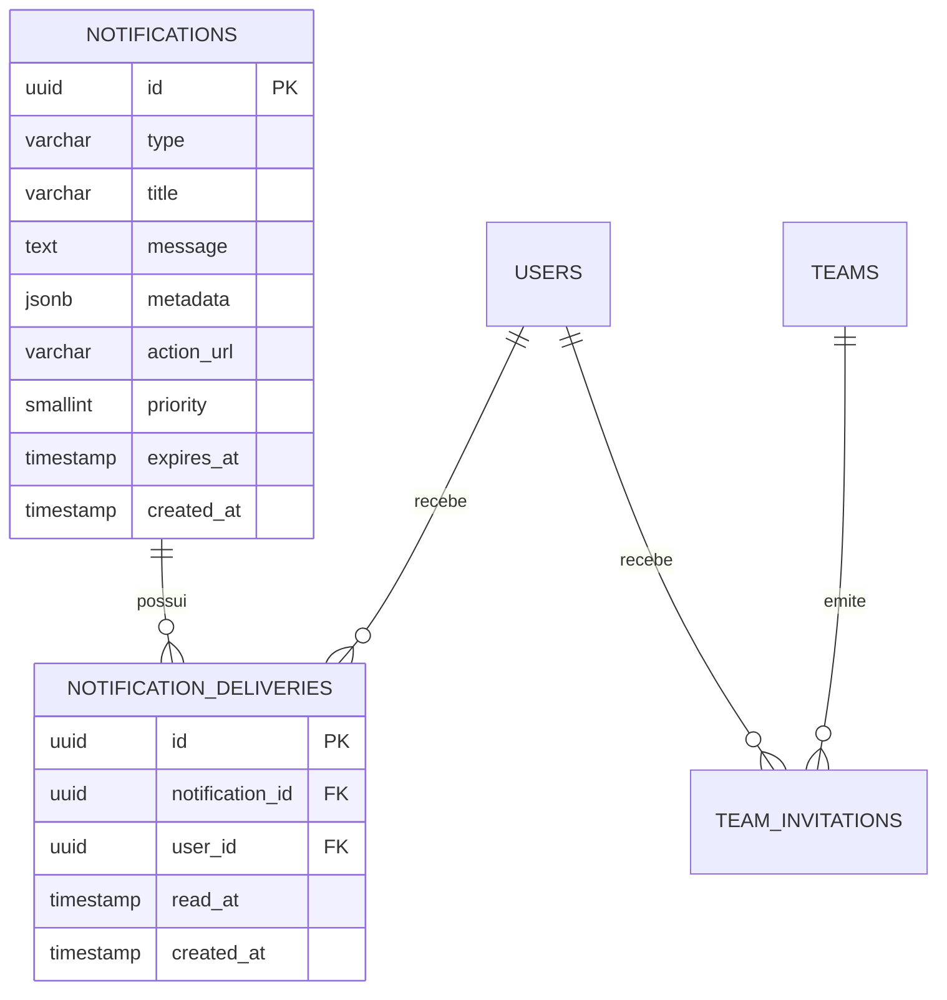

# Notificações no PostgreSQL

> **Estado: implementado em 21/08/2026.** A migration
> `V4__notifications_in_postgres.sql` remove a dependência operacional do MongoDB
> e estabelece PostgreSQL como fonte transacional única de notificações e convites.

[← Índice](./00_index.md)

## Decisão e limites

O MongoDB foi removido do backend, dos arquivos Compose, das variáveis de ambiente
e dos testes. Notificações agora ficam no PostgreSQL junto com os fluxos de time.
Isso reduz uma dependência operacional sem perder flexibilidade: o conteúdo aceita
um `type` aberto, metadados JSONB e uma URL de ação.

Convites, pedidos de entrada e links de convite **não são notificações**. Eles
continuam nas tabelas `team_invitations`, `team_join_requests` e
`team_invite_links`, que guardam validade, status, permissões e invariantes de
negócio. A notificação apenas informa o usuário e aponta, em `metadata`, para a
entidade responsável pela ação.

## Modelo atual

- `notifications` contém conteúdo imutável, reutilizável por vários destinatários.
- `notification_deliveries` contém a caixa de entrada: destinatário, momento de
  entrega e leitura. A unicidade `(notification_id, user_id)` impede duplicação.
- A API retorna o ID da entrega; `PATCH /notifications/{id}/read` altera somente
  a leitura daquele usuário. `PATCH /notifications/read-all` executa atualização
  em lote para a caixa do usuário.
- A inbox exclui itens expirados. Há índice por usuário/data e índice parcial para
  não lidas; tamanhos de página são limitados a 100.
- Prioridade vai de 0 a 3. `metadata` deve carregar apenas contexto de interface,
  como `teamId`, `inviteId` ou o identificador de uma campanha; não substitui o
  estado de domínio.

Os tipos já disponíveis cobrem eventos de time, sistema, anúncio, sugestão,
descoberta e amizade. Para novas capacidades, o serviço aceita tipos curtos
validados, por exemplo `campaign.weekly_digest` ou `friend.request`, sem exigir
alteração de schema. A convenção recomendada é minúscula e pontuada no chamador;
o armazenamento normaliza para maiúsculas para consultas consistentes.

## Fluxos implementados

As ações de time já existentes criam notificações PostgreSQL para criação de time,
convites, pedidos de entrada, aprovação/recusa, uso de link e alteração de cargo.
Cada evento cria conteúdo e entrega no mesmo banco; o registro de convite/pedido
segue como fonte de verdade para aceitar, rejeitar ou expirar a ação.

O serviço também oferece envio para uma audiência limitada: uma única notificação
e uma entrega por usuário, com deduplicação de destinatários. É adequado para um
time, beta fechado ou comunicado pequeno.

## Evolução sem redesenho

### Comunicados, campanhas e sugestões

Para banners, curiosidades, propaganda interna ou sugestões, use um tipo
namespaced, `action_url`, prioridade, expiração e um identificador de campanha em
`metadata`. Não execute uma fan-out de milhões de linhas no request HTTP.

Quando houver esse volume, adicione um módulo `campaigns` e um worker com:

1. segmentação versionada e critérios auditáveis;
2. criação de entregas em lotes idempotentes, por `INSERT ... SELECT` ou filas;
3. outbox no PostgreSQL para disparo confiável de push/e-mail/websocket;
4. métricas de entrega, leitura, opt-out e retenção;
5. limites por canal e revisão de consentimento/LGPD.

A tabela atual continua sendo a inbox e a fonte de leitura; o worker passa a ser
o produtor assíncrono, não uma segunda base de dados.

### Amizades futuras

Amizade deve ganhar estado próprio no PostgreSQL, por exemplo `friend_requests`
e `friendships`, com solicitante, destinatário, status, timestamps, unicidade e
bloqueios. `FRIEND_REQUEST` e `FRIEND_REQUEST_ACCEPTED` são apenas eventos de
interface. A tela deve consultar a relação de amizade para executar uma ação; não
deve inferir permissão a partir de uma notificação lida ou expirada.

## Implantação e dados legados

A aplicação executa a V4 automaticamente via Flyway. Antes de remover qualquer
volume antigo de MongoDB, faça backup e inventário. Esta mudança não apaga volumes
nem tenta migrar documentos automaticamente, pois um documento legado pode ter
campos e IDs sem correspondência verificável em produção.

Se houver dados a preservar, execute uma migração única em ambiente de manutenção:

1. exporte e congele a coleção Mongo;
2. valide que cada `userId` corresponde a `users.id` no PostgreSQL;
3. converta cada documento em uma linha de `notifications` e uma de
   `notification_deliveries`, preservando `createdAt` e convertendo `isRead` para
   `read_at` (use `created_at` como aproximação quando o instante de leitura não
   existir);
4. valide contagens por usuário e uma amostra de metadados; só então retire o
   volume antigo conforme a política de backup.

Sem dados de produção fornecidos, nenhuma exclusão ou importação de dados foi
executada neste repositório.

## Operação e próximos controles

- O perfil oferece canais de contato opcionais e privados (`email` e
  `phone_e164`), disponíveis somente em `/users/me/contact`; eles não são
  serializados no perfil público, busca ou cache de perfil. Telefone é armazenado
  em E.164, e campos em branco removem o respectivo canal.
- Nenhum envio por e-mail ou WhatsApp está ativo. Antes de ativá-los, implementar
  verificação de posse, opt-in separado por canal/finalidade, opt-out, limites de
  frequência, registro de consentimento e fornecedores aprovados para LGPD.
- Definir retenção (por exemplo, expirar comunicados e purgar entregas antigas em
  job auditável) antes de campanhas amplas.
- A cobertura PostgreSQL + Redis via Testcontainers valida JSONB, índices e a V4
  contra o banco real; H2 foi removido. Consulte a [estratégia de testes](./11_testes_integracao.md).
- Adicionar outbox antes de push, e-mail ou websocket com requisito de entrega.
- Autorizar emissores administrativos de campanha e registrar auditoria de quem,
  para qual segmento e por qual motivo enviou uma mensagem.
